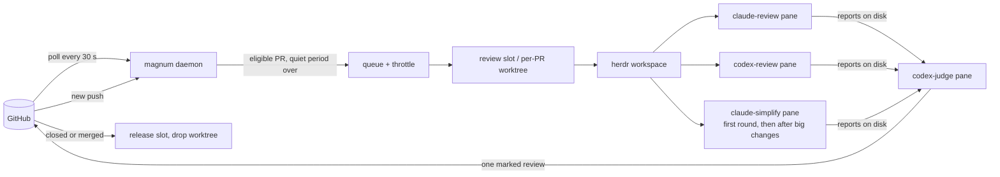

<p align="center">
  
</p>

<h1 align="center">Magnum PR</h1>

<p align="center"><strong>Multiple agents. One review. No drama.</strong></p>

<p align="center">
  <a href="https://go.dev/"></a>
  
  <a href="https://herdr.dev"></a>
  <a href="https://cli.github.com/"></a>
  <a href="LICENSE"></a>
</p>

Magnum is a private investigator for pull requests. It watches your GitHub repositories all day,
checks every eligible PR out into its own worktree, lets several coding agents review it side by side
inside [herdr](https://herdr.dev) panes, and then a **judge** agent proves or rejects every candidate
finding, runs the checks, and posts exactly **one** review as the identity you choose: your own
account or a GitHub App. When the author pushes, the same agent sessions pick up where they left off:
they pull the delta, read the replies, and re-review only what changed. When the PR merges, the folder
and its databases are released. You keep working; Magnum keeps the review queue empty.

> [!NOTE]
> **Disclaimer:** this repository is 100% vibecoded and, I'd say, 100% awesome. It saves me hours, and I
> use it every day. If you're happy to let AI review your pull requests, I hope you won't mind that AI
> wrote the reviewer too.

- **Multiple agents, one review.** Claude, Codex, droid, omp or any CLI herdr can drive, each with its
  own prompt, model, credentials and schedule, feeding candidate findings to a judge that posts once.
- **Sessions that remember.** Re-reviews re-prompt the sessions that reviewed the PR before, so the
  judge knows what it already said, what was fixed and what the author answered.
- **Reviews you can watch.** Every agent runs in a visible herdr pane titled `PR #123 claude-review - repo`;
  jump to it, read it, or take over.
- **A registry, not a guess.** Which folder holds which PR, which databases belong to it, who reviewed
  what and when, all in SQLite; cleanup happens on close, on merge, or on your command.
- **Throttled on purpose.** A push is not a review: quiet periods, minimum intervals and daily caps keep
  agent-driven commit storms from burning your subscription.
- **Honest about failures.** Logged-out agents, usage limits, overloaded APIs and trust dialogs are
  detected, surfaced in the dashboard, and retried with backoff. A cap on one model ("You've reached
  your Fable limit") switches the session to the kind's next `fallback_models` entry and the run
  carries on; only an account-wide limit pauses the agent kind. GitHub is the only proof a review was
  posted.

## How it works



1. **Poll.** One GraphQL query per organization finds new PRs, new heads, new repositories and closed
   PRs. Open PRs that existed before Magnum started are left alone until they change.
2. **Throttle.** A new head waits for a quiet period (default 5 min, 15 min after a burst of three
   pushes within 30 min) and at least 30 min since the previous round (2 h for drafts); pushes coalesce
   to the latest head; `magnum review` overrides.
3. **Check out.** Pool repositories (big apps with databases) get one of N provisioned slots; small
   repositories get a worktree next to their clone. Checkouts are detached, so they never collide with
   branches you have open yourself.
4. **Review.** Every role from the pipeline configuration gets a pane: candidate reviewers run in
   parallel, an optional simplifier applies and captures a cleanup patch (then the tree is restored),
   and the judge gets all reports plus its own full pass.
5. **Post and verify.** The judge posts one review with inline comments and an invisible run marker;
   Magnum verifies on GitHub that exactly that review by exactly that identity exists for that commit.
6. **Repeat and clean up.** New commits re-prompt the same sessions. A push while the reviewers still
   run restarts them in place on the new head (at most twice per round); a push while the judge works
   is noted on the posted review and re-reviewed right after the quiet period. A closed or merged PR
   releases its folder after a grace period, with teardown hooks for its databases.

## Quick start

Requirements: macOS (see [Linux](#linux) below), [herdr](https://herdr.dev) 0.9.3+ running, `gh` logged
in and the agent CLIs you want to use (`codex`, `claude`, `droid`, `omp`). MySQL only for a `[[pool]]`
that declares databases; [mise](https://mise.jdx.dev) only for a pool whose worktrees use it.

```bash
brew install zhuravel/tap/magnum             # built from source by Homebrew
magnum init                                  # ~/.config/magnum/config.toml: your gh login, one repository, who posts
magnum doctor                                # what this setup uses, with the exact fix for each problem
magnum daemon                                # in a second terminal or herdr pane: the daemon in the foreground
magnum review owner/repo#123 --wait          # one review of that repository's PR, start to finish
```

When the review has posted, hand the daemon to launchd (`install` stops the foreground one) and add the
extras you want:

```bash
magnum install --plugin                      # launchd agent + herdr plugin
magnum install --gh --no-launchd             # optional: `gh magnum …`
magnum completion zsh > "${fpath[1]}/_magnum"
```

To upgrade: `brew upgrade magnum && magnum daemon-restart --drain` (the daemon keeps running the old
binary until it restarts; `--drain` waits for the rounds in flight).

`magnum init` refuses to replace an existing config without `--force` (the old file is kept as
`config.toml.bak`); [config.example.toml](config.example.toml) is the same minimal setup to copy by hand.
To post as a GitHub App, answer 2 when init asks who posts: it asks for the App's ids and names the file
to save its private key as, `~/.config/magnum/keys/<app>.pem` (it never asks for the key); `magnum
identities check` verifies the App. A big repository with its own databases gets a pool of warm slots:
add a `[[pool]]` (see below), then `magnum slots provision --count 6`.

## Configuration

Two layers and the App keys:

- The built-in defaults: [config.defaults.toml](config.defaults.toml), embedded in the binary. The
  daemon defaults, the agent kinds and the review roles, every key documented; it names no account,
  repository or path of yours. Editing it changes the defaults after `make build`.
- Your config, `~/.config/magnum/config.toml` (`$XDG_CONFIG_HOME/magnum/config.toml` when that is set;
  `magnum init` writes it): your identities, watches, pools and repos, plus any default you want to
  override. Its `[[watch]]`, `[[identity]]`, `[[pool]]` and `[[repo]]` blocks are appended, a `[[role]]`
  overrides the keys it sets on the role of the same name (or is appended), scalar keys and
  `[kinds.<name>]` entries override key by key. [config.full.example.toml](config.full.example.toml) is
  a complete, working setup (Talkable's) to copy from. `magnum config` and `magnum doctor` say which
  files were read.
- App private keys: PEM files the identity's `private_key_file` names, by convention
  `~/.config/magnum/keys/<identity>.pem` (chmod 600; doctor warns about a looser mode). The older
  `private_key_env` (an environment variable holding the PEM or its path, e.g. from a checkout's
  `.mise.local.toml`) still works; launchd then runs the daemon through `mise exec`.

Magnum keeps its own files where XDG says: the registry, review reports and repository notes in
`~/.local/share/magnum` (`$XDG_DATA_HOME`), logs, locks, the identities' gh config dirs and the tab-bar
file in `~/.local/state/magnum` (`$XDG_STATE_HOME`); `magnum config` prints both. A checkout that kept them
in its `state/` keeps using it until `magnum migrate-home` moves them (it stops the daemon, renames every
item, links nothing back, removes the emptied `state/` and restarts launchd's job); `MAGNUM_HOME=<checkout>`
keeps that layout on purpose, for development.

`--config FILE` (or `$MAGNUM_CONFIG`) replaces the built-in defaults with a complete file of your own.
A `config.local.toml` in the checkout, where settings lived before, is still read when
`~/.config/magnum/config.toml` does not exist; doctor says how to move it.

The daemon prunes audit events older than `[daemon] keep_events` (default `"30d"`) and handled CLI
requests older than `keep_requests` (default `"7d"`) on every reconcile; `"0"` keeps them forever.

A push that lands while a round's reviewers still run restarts them on the new head, up to
`[daemon] max_round_restarts` times per round (default 2; `0` turns restarts off). A push that lands
while the judge works lets the round finish: Magnum appends "Reviewed <sha>; N commits arrived during
the review, re-review follows" to the posted review and queues the re-review without waiting for
`min_rereview_interval`. A PR whose head changed `burst_pushes` times (default 3) within `burst_window`
(default `"30m"`) waits `burst_quiet_period` (default `"15m"`) instead of `push_quiet_period`; a
`[[watch]]` can override all three, and `burst_pushes = 0` turns the rule off.

A push whose changes since the last review are only comment lines, whitespace or documentation is not
re-reviewed: Magnum compares the reviewed commit with the new head (one GitHub call), moves the review
to the new head with its verdict, keeps an App's approval and records `pr.trivial_delta`. When such a
commit arrived during the judge's turn, the note on the review says "(comments only), no re-review
needed" instead. `[daemon] skip_trivial_deltas` (default `["comments", "whitespace", "docs", "base"]`,
`[]` = re-review every push) picks the kinds, a `[[watch]]` can override it, and `magnum review` always
runs.

A push that merges the base branch into the PR (or rebases it onto the base) is judged by the PR's own
diff, not by the commits it brings: when the comparison of the reviewed commit with the new head shows a
merge commit or a divergence, Magnum compares the PR's diff against its base before and after the push
(two more GitHub calls, `<base>...<reviewed>` and `<base>...<head>`), file by file, by the sequence of
added and removed lines (context lines and hunk positions, which master's changes move, do not count).
When no file's own change differs, the push is the kind `base` ("base merge only"): the review stands
and `pr.trivial_delta` says, e.g., "the push to 2017f29 only merges master (13 commits, the PR's own
changes unchanged)". A file without a complete patch, or a diff over GitHub's 300-file cap, makes the
comparison incomplete, and the push is measured as any other. A daemon that starts on this rule checks
the PRs already waiting for a re-review once more, on its first poll, and settles those a base merge
queued.

Any other push is measured by the same GitHub call: the changed lines that are code (not comments,
blank lines, whitespace moves or documentation) since the reviewed commit; after a base merge or a
rebase, only the lines that changed in the PR's own diff. An automatic re-review runs after the quiet
period once that delta reaches `[daemon] rereview_min_lines` (default 30) or adds a file; a smaller
delta waits for further pushes, at most `rereview_max_wait` (default `"2h"`) after its first push.
`rereview_min_lines = 0` turns the threshold off, and a `[[watch]]` can override both.

A review request runs without delay: when someone requests a review from the poll login, from a posting
identity's login (an App's `<slug>[bot]` too) or from a team a `[[watch]]` lists in `request_teams`, or
marks a draft ready for review, the round starts `[daemon] request_debounce` (default `"1m"`) after the
request and the last push. It skips the quiet periods, the re-review intervals, the delta threshold and
the daily cap. Requests are edge-triggered by their time on the PR's timeline: one counts once, and only
when it is newer than the PR's last round start; a review of the head posted after it answers it too.

The daily cap (`max_rounds_per_pr_per_day`, default 12) counts automatic rounds when they start:
requested rounds and `magnum review` never count. A round Magnum itself cut short is refunded
(`round.refunded`): one a shutdown, restart, drain or abort stopped, one that failed before any agent
was prompted or on a prompt this build could not render, and one whose judge ran out of fallback
models. Posted, blocked, timed-out and needs-attention rounds count.

Every PR waiting for a round says why and until when: the dashboard's queue and the PR board show a
compact form (`re-review · quiet → 14:09`, `re-review · cap 6/6 → 00:00`, `re-review · small delta
8/30 lines → 16:40`, `re-review · requested by alice → now`), and the card and
`magnum status <ref>` the full sentence with the command that lifts it (`magnum review <ref>` for the
timing rules, `magnum resume` for a pause).

A fetch, clone, checkout or dependency step that fails for a reason outside the PR (an SSH key the
agent lost, DNS, a network timeout or refusal, TLS, or the same dependency error on two PRs within ten
minutes) pauses dispatch for everything once, with one toast, and is never charged to the PR. Magnum
probes `git ls-remote` of a watched clone (over HTTPS through gh, like its fetches) after 2 minutes, then after twice as long each time it still
fails (up to 30), and resumes by itself when it answers; `magnum resume` lifts the pause at once.

The `[usage]` section watches the Codex budget, which Magnum reads from Codex's own session files
(`codex_home`, default `$CODEX_HOME` or `~/.codex`) at most once a minute. At `codex_soft` percent
(default 80) first reviews wait while re-reviews and `magnum review` still run; at `codex_hard` (default
95) every round that needs Codex waits until the budget is below it again. `magnum status` and the tab
bar show the gauge (`codex 87%`); `0` turns a cap off.

Once every agent of a reviewed PR has been idle for `[daemon] park_idle_after` (default `"2h"`, `"0"`
never) its sessions are parked to free memory; the next round resumes them. Pinned PRs and PRs you typed
into within `human_cooldown` keep their agents.

### Identities: who posts

```toml
[[identity]]
name = "me"
kind = "gh"                        # your gh login
login = "your-login"
no_findings_event = "APPROVE"

[[identity]]
name = "reviewer-app"
kind = "app"                       # a GitHub App: reviews appear as <slug>[bot]
login = "your-app[bot]"
app_id = 123456
client_id = "Iv23liXXXXXXXXXXXXXX"
installation_id = 12345678
private_key_file = "~/.config/magnum/keys/reviewer-app.pem"
no_findings_event = "COMMENT"      # never let a bot approval unlock a merge by accident
```

App tokens are minted from a short-lived JWT and refreshed before they expire; every GitHub call,
including those, goes through `gh api`, so no extra firewall rules are needed. `magnum identities
check` verifies the key, the App, the installation, its permissions and that `login` is the App's
`<slug>[bot]`. A PR follows its watch's identity. When you move a watch to another identity, the next
round of each of its PRs posts as the new one (`pr.identity_migrated`): it parks the sessions the old
identity ran in, reads the old login's reviews and threads as its own history (the previous review, the
replies to answer, the earlier findings), and once its review is posted dismisses what the old identity
left standing, its change requests and an App's approvals, with the old identity's own credentials.
`magnum review --as <identity>` pins one PR to an identity, and a pinned PR never migrates.

### Watches, pools and repos: what to review and where

```toml
[[watch]]
owner = "talkable"
include = ["talkable"]             # repository globs; ["*"] for the whole organization
identity = "reviewer-app"          # who posts
poll_identity = "me"               # who polls
include_drafts = true
skip_bot_authors = true
skip_departed_authors = true       # default: a branch PR by someone no longer a member or collaborator is not reviewed
roles = ["claude-review", "codex-review", "claude-simplify", "codex-judge"]

[[pool]]                           # a big app with its own databases: a pool of warm slots
repo = "talkable/talkable"
main_clone = "~/Projects/talkable"
slot_path = "~/Projects/talkable.review{n}"
min = 12
max = 18
setup = ["bin/worktree-setup"]     # runs once per slot with WT_BRANCH=review<n>
teardown = ["bin/worktree-archive"]
copy_files = [".mise.local.toml", "config/initializers/local.rb"]
```

Repositories without a pool get a worktree per PR (`<clone>__worktrees/pr-<N>`). If the clone has
[worktrunk](https://worktrunk.dev) hooks in `.config/wt.toml`, Magnum runs them with
`WT_BRANCH=magnum-pr-<N>` on create and before removal, so apps that derive databases from the
workspace name get isolated ones. A `[[repo]]` block can declare `setup`, `teardown`, `copy_files` and
`env` explicitly instead. Its `no_findings_event` and `blocking_event` override the posting identity's
verdicts for that repository, pooled or not. When a PR an App identity approved gets new commits,
Magnum dismisses that approval before the re-review is queued; `keep_approvals = true` on the
`[[repo]]` (or the `[[watch]]`) keeps it. `prepare` (such as `["bin/rails db:test:prepare"]`) and
`ready` (probes, exit 0 = ready) on a `[[pool]]` or `[[repo]]` run in the checkout before the
reviewers, as `zsh -lc` with the slot's env and within `ready_timeout` (5m) together, followed by a
check that the login shell runs the Ruby the checkout pins; a failure never stops the round, it tells
the judge what will not work. A watch's `skip_paths` (path globs where `**` spans
directories, such as `["docs/**", "**/*.md"]`) skips a PR whose changed files all match, while a forced
`magnum review` still runs it. See the comments in `config.defaults.toml` for every key.

### Roles and kinds: the review pipeline

The pipeline is data. Each `[[role]]` is a pane: which agent runs it, with which prompt, model,
effort and credentials, when it runs and how its report is captured. Exactly one role per watch is
the judge.

```toml
[[role]]
name = "claude-review"
kind = "claude"                    # codex | claude | droid | omp | … | shell
prompt = "claude-review.md"        # prompts/<file>; embedded defaults when absent
rereview = "claude-rereview.md"    # new commits since its last report: the delta only
restart = "claude-restart.md"      # a push cut its review short; the round restarted on the new head
effort = "high"
runs = "always"                    # always | first | manual | never
output = "claude-review.md"        # the report the judge receives

[[role]]
name = "codex-review"
kind = "shell"
tool = "codex"                     # codex's login check, pauses and health patterns apply
command = "command codex review --base {{if .BaseSHA}}{{.BaseSHA}}{{else}}{{.BaseRef}}{{end}}"   # the merge base
capture = "stdout"

[[role]]
name = "claude-simplify"
kind = "claude"
prompt = "claude-simplify.md"
runs = "first"                     # first review of a PR, then on request (`magnum review --role claude-simplify`, or `--simplify`)
rerun_min_lines = 150              # ...and again once 150 code lines changed since its last run (0 = never)
capture = "git-diff"               # the patch it would apply; the tree is restored afterwards
output = "claude-simplify.patch"
after = ["claude-review", "codex-review"]

[[role]]
name = "codex-judge"
kind = "codex"
judge = true
skill = "{{repo}}/skills/magnum-review/SKILL.md"
prompt = "judge-initial.md"
rereview = "judge-rereview.md"
effort = "xhigh"
rereview_effort = "high"           # re-reviews of new commits; the first review stays at xhigh
timeout = "90m"
```

Non-judge roles run in parallel unless `after = [...]` orders them; the judge runs last and gets every
other role's report. With no `[[role]]` at all Magnum runs these four built-in roles, which
`config.defaults.toml` writes out in full; a block named like a built-in role inherits every key it does not
set. The old `[codex]` and `[claude]` sections still work as fallbacks for the matching keys.

A role whose `runs` is `first` (after its first run) or `manual` runs when asked:
`magnum review <ref> --role <name>` adds it to one round (repeat the flag for several), and a `never`
role is refused. `--simplify` is the shorthand for the role aliased `simplify`, claude-simplify by
default. `magnum roles` prints the effective roles per watch with the prompt file each resolves to, and
`magnum roles --kinds` prints how each agent kind is started, resumed and checked for login, so you can
see what Magnum will type.

`[kinds.<name>]` tables describe how each agent CLI is started, resumed, named, given a model and
effort, checked for login and classified for usage limits (`codex`, `claude`, `droid` and `omp` ship
with defaults; any herdr-supported kind can be added). Prompts are files under `[pipeline]
prompts_dir` (default `prompts/`, falling back to copies built into the binary), so a prompt change is
a file edit, not a rebuild. The daemon loads the prompts and a copy of the judge skill when it starts,
right after checking that its build renders them, so an edit takes effect at the next
`magnum daemon-restart`; `magnum status` counts the files changed on disk since. [prompts/README.md](prompts/README.md) lists every key, every template
variable and examples (a droid simplifier, an omp reviewer, a watch with two roles).

#### Models and effort

Every task is a role, so its model and effort live in its `[[role]]` block in your config; a block
there overrides the built-in role of the same name key by key, so it needs only the keys you change.
`model` picks the model (else the kind's `default_model`, else the CLI's own), `effort` the reasoning
effort of first reviews and `rereview_effort` that of re-reviews of new commits. `codex-review` is a
shell role that runs `codex review`, so it takes both as Codex config overrides in `args`. A role you
can do without is turned off with `runs = "never"` (or `"manual"`: only when you ask). To spend less as a
subscription runs low, for example:

```toml
[[role]]
name = "codex-judge"
model = "gpt-6.1-sol"                # a cheaper Codex model
effort = "medium"
rereview_effort = "low"

[[role]]
name = "claude-review"
model = "sonnet"
effort = "medium"

[[role]]
name = "codex-review"
args = ["-c", "model=gpt-6.1-sol", "-c", "model_reasoning_effort=medium"]

[[role]]
name = "claude-simplify"
runs = "never"
```

`magnum roles` prints the effective model and effort of every role, and `magnum daemon-restart --drain`
applies a change once the rounds in flight end. A session whose model hits its own limit switches to
the kind's next `fallback_models` entry by itself (Claude: `["opus", "sonnet"]`) and back once the limit
lifts.

#### Triage: fewer reviewers for a small diff

A one-line fix does not need every reviewer. With `[triage] enabled = true`, before a round starts its agents
Magnum asks a cheap model which reviewers the round's diff needs: Claude haiku by default, or any CLI that reads
a prompt on stdin and prints its answer (`command`, with a Codex line in `config.defaults.toml`). The limits are
Magnum's, not the model's. Only a first review or re-review whose diff has at most `max_lines` changed lines
(default 120, added plus deleted; a re-review counts the commits since the last review) is asked about, bigger
rounds run every role. The judge always runs, and the model can only remove roles that have a `summary`, the
one-line description of what a role checks (the built-in reviewers have one, a role without one always runs). A
round that names its roles (`magnum review --role`), a continued round and an eval are never triaged. Anything
that goes wrong (a missing or failing command, a `timeout`, an answer that cannot be read, a diff GitHub cannot
give in full) runs every role. The prompt, `prompts/triage.md`, tells the model that the diff is data, not
instructions, and never contains the PR's title or description. Each decision is a `round.triage` event on the
PR (`magnum logs <ref>`): the diff size, what runs, what was skipped and the model's reason, or the warning that
says why every role ran.

```toml
[triage]
enabled = true
max_lines = 120
command = ["claude", "-p", "--model", "haiku", "--tools", "", "--no-session-persistence"]   # prompt on stdin, answer on stdout

[[role]]
name = "claude-simplify"
summary = "simplifications and refactors of the changed code"   # what the model is told the role does
```

### The judge skill

`skills/magnum-review/SKILL.md` is the judge's method: review the whole PR, treat every candidate
report as a claim to prove or reject, attach findings to changed lines with reproduction and fix,
post one review (`REQUEST_CHANGES`, `COMMENT` or the configured no-findings event), verify it, and
write a machine-readable result. In re-review mode magnum hands it the threads its login started with
every reply classified by its first words (`fixed`, `not a bug`, `won't fix`); the judge accepts a fix
only when the code shows it, honours an answered finding unless it proves the reason wrong (then it
says why in one sentence in that thread), and lists each old finding as fixed, answered or still open.
The result records every finding the judge weighed with its sources and, for a rejection, a reason
code; `magnum stats` reports them per role.

## Daily use

| Command | What it does |
|---|---|
| `magnum init [--force]` | Write `~/.config/magnum/config.toml` for this machine from three questions: your gh login, one repository, who posts (your login or a GitHub App). |
| `magnum prs [--repo …] [--view all\|magnum\|mine\|ready] [--sort updated\|last-review\|reviewer-activity\|requested\|changes\|state] [--all] [--json]` | The PR board: every watched PR with its last review, each reviewer's verdict (with staleness), when a review was last requested (and whether of you), what changed since the last review, assignees; then the PRs merged or closed in the last day (`[board] recent_closed`), flagging one merged before Magnum reviewed its last push. `--view` keeps what Magnum reviewed, what is yours or what is ready to merge. Live screen on a terminal, table or JSON otherwise. |
| `magnum status [<ref>\|<slot>] [--all] [--sizes] [--json] [--watch]` | Daemon, slots, queue, pauses; a PR's detail card with its review history and the last round's stage timings. `--watch` is the live dashboard (`tab` flips to the PR board). |
| `magnum stats [--since 7d] [--repo owner/name] [--json]` | Review statistics per local day and repository over a window (`--since` takes `7d`, `36h`, `90m` or a date; default 7d): rounds started and how they ended, findings posted by priority, median and p90 durations per role and per round, how many findings each source raised, had posted, had posted alone or had rejected (with reason codes), and model switches, denied prompts and round restarts. |
| `magnum eval run\|score\|list\|show` | Measure a prompt, skill or model change: `run` replays the PRs with known defects in `~/.config/magnum/eval.toml` (see `eval.toml.example`) at their pinned heads as blind dry runs and reports, per case, the seeded defects the planned review found, at what severity, and its other findings (noise), next to the previous run. `score` re-scores a run after a match rule is fixed, without the agents. |
| `magnum retro [<ref>...] [--again] [--lookback 14d] [--json]` | Run the retro now (see Learning from other reviewers): classify what other reviewers said about the PRs closed within the lookback, whether or not `[learn] enabled`. `--again` looks again at PRs a retro already did; PRs named by `<ref>` are looked at again in any case. |
| `magnum misses [<ref>] [--all] [--class miss\|not_issue\|style\|outside\|unclassified] [--json]` | What other reviewers caught and Magnum did not: the retro's new misses, with the reviewer, where, severity, whether Magnum's judge had raised and rejected it, the title and the lesson. `--all` lists every class and state. |
| `magnum review <url\|owner/repo#N\|repo#N\|N> [--fresh] [--role <role>] [--simplify] [--as <identity>] [--no-post] [--wait] [--timeout <duration>]` | Force a round now, bypassing throttles. `--role` (repeatable) also runs an on-demand role this round; `--simplify` is its shorthand for the role aliased `simplify` (claude-simplify by default). `--wait` follows the round; `--timeout` stops following after that long while the round goes on. On a PR GitHub merged it is a post-merge review: the commits Magnum missed since its last review (the whole PR when it never reviewed it), posted as a comment only, after which the PR is released again; a merged PR whose head was reviewed and a PR closed without merging are refused. |
| `magnum open <ref> [--role <role>]` | Focus the PR's pane in herdr and reveal the herdr client (focus the existing iTerm2 tab, or open a new one). |
| `magnum watch <ref> [--role <role>] [--ansi]` | Read-only live mirror of a pane in any terminal. |
| `magnum roles [--repo owner/name] [--kinds] [--json]` | The effective roles per watch (kind, runs, model, effort, capture, output, prompt file and whether it is yours or built in, after, judge, aliases). `--kinds` shows how each agent CLI is started and resumed, and which models it switches to when one hits its own limit, instead. |
| `magnum attention [--list]` | Jump to whatever needs you: a blocked agent, a failed round, an unseen result. A PR in needs_attention is explained in one line (the stage, how many attempts on which head, the line of the output that names the cause) with the next step; `magnum status <ref>` adds the failing step and the end of its output, and the dashboard, the PR board's card and `magnum review --wait` say the same. |
| `magnum pick` | Filterable PR picker; the herdr popup and ctrl+click on PR links use it. |
| `magnum pin\|unpin\|release\|mute\|unmute <ref>` | Hold a PR's slot and sessions, hand them back, stop automation for a PR (on a merged PR `mute` dismisses its merged-unreviewed flag and `unmute` restores it). |
| `magnum abort <ref>` | Kill a PR's running review: its agents are interrupted, its runs abandoned, its sessions parked and a pool slot handed back. The PR returns to reviewed (or baseline) until the next push. |
| `magnum approve <ref> [-m TEXT] [--force]`, `magnum request-changes <ref> [-m TEXT] [--force]` | Your own verdict on the head magnum reviewed, posted by the daemon as the PR's posting identity with a body that names magnum's review and its findings: for repositories where magnum only comments, or when you decide differently. The head must still be the reviewed one unless `--force`. A manual approval follows the head like magnum's own; magnum's later rounds never dismiss a manual verdict as their own stale review. Board keys `A` and `C`. |
| `magnum ignore <ref>` | Abort, then mute the PR as ignored and free its slot: the daemon never queues it again until `magnum unmute <ref>`, which undoes the ignore. |
| `magnum notes <repo> [--edit]` | The repository notes every role reads first and the judge rewrites after a round that taught it something (`~/.local/share/magnum/notes/<owner>/<repo>.md`): what the repo is, how to test and QA it, known pitfalls. |
| `magnum cleanup [--dry-run] [--pr <ref>] [--slot <name>] [--orphans [--slug X]] [--shrink] [--external --slot repoN]` | Storage cleanup with a reviewable plan: closed PRs, orphan databases, idle slots, manual worktrees. |
| `magnum slots [list\|provision\|remove\|repair\|adopt\|pin\|unpin]` | Pool management. |
| `magnum where <ref>` | `cd $(magnum where 123)`. |
| `magnum pause\|resume`, `magnum logs [<ref>] [-f]`, `magnum doctor`, `magnum identities check`, `magnum kick` | Operations. `pause` holds automatic reviews; a review you ask for (`magnum review`, the board, the picker) still runs. |
| `magnum daemon [--once] [--dry-run]`, `magnum install\|uninstall\|daemon-restart\|daemon-stop [--now]`, `magnum migrate-home` | The daemon and its launchd job (`migrate-home` moves a checkout's `state/` to the XDG places, see Configuration). Stop and restart refuse while review rounds are in flight unless `--now`; `daemon-restart --drain` and `install --drain` stop new rounds, wait for those in flight (at most `--timeout`, default 2h) and then restart. `daemon-restart` and `install` first run `magnum config` with the binary launchd will run, which validates the configuration and renders every prompt with the build that will run, and refuse when it fails; the daemon refuses to start on the same errors (written to `daemon.log` and `launchd.log`). After a build that adds a registry migration, other commands refuse to run while the older daemon is up (they would migrate the registry under it) and point at `daemon-restart --drain`. |

Shell completion is dynamic: PR references complete from the registry with their titles, slots,
identities, roles and sorts from config.

### The PR board

<!-- screenshot placeholder: assets/prs.png -->

One row per open PR, newest activity first: repository and PR number (two columns, so a long repository name never hides the number), title, author, assignee, updated age, when a review was last requested
(`★ 2h` when of you, also for an older PR whose author asked again; the dimmed age of the latest request
when of someone else; it comes from the PR's timeline, which Magnum reads for the newest ten requests),
Magnum's state badge, the last review (who, verdict, age, ⟳ when the head moved since), what changed since
(`3c +41 −7`), and reviewer chips with a verdict glyph each (✔ approved, ✗ changes requested,
💬 commented, ◌ requested, ⟳ stale); yours and Magnum's are starred, and a bot's login carries the bot
mark (🤖, or `[bot]` in ASCII), so an App named like you (`zhuravel[bot]`) never reads as you. `enter` opens the card with the full
per-reviewer table (and a line with the latest request to each reviewer: who asked and when) and the last
round's stage timings (fetch/checkout, each role, verify, total); `/`
filters; `v` cycles the views; `s`/`S` sort (updated, last review, reviewer activity, requested, changes,
state; the requested sort puts the newest request first, the one the column shows, and PRs nobody asked
last); `L` cycles the layout (below); `r`, `R`, `i` start review variants (a post-merge review on a
merged PR, below); `o` opens the pane; `p`/`u` pin; `x` releases; `M`/`U` mute (on a merged PR, below); `K` kills the running review; `I` ignores the PR (an ignored
row is greyed with its title struck through, and `U` unmutes it, which stops ignoring it); `A` approves
and `C` requests changes as the PR's posting identity (see `magnum approve`); `b` opens the browser;
`t` opens the PR's issue in its tracker (below); `tab` switches to the status dashboard. Every action that stops or starts work asks y/N first.

A PR takes one line while every column fits at its content width with a title of 40 cells; on a
narrower screen it takes two: what the PR is (repository and number, title, author, assignee, updated,
requested) and, indented and dimmed, where it stands (state, last review, findings, CI, since review,
reviewers), each line with its own headings. A line that still does not fit drops its own columns: since
review, then last review on the second line; assignee, then author, then requested on the first. `L`
cycles auto (the default), one line (columns give way on a narrow screen, as they always did) and two
lines; the title bar names the layout when it is not auto, and the choice is kept across runs. A click on
either line of a PR is a click on the PR, and each heading line sorts and resizes its own columns.

CI shows the head's checks: the repository's required checks when it has some (read from GitHub's
rulesets, or `[[repo]] required_checks`; `✗ Completion`, `– Completion not run` when it never ran on the
head, `⊘ Completion skipped`), else the counts (`✓ 65/65`, `✗ 2 failed`, `◌ 40/65`); the card lists the
checks per workflow and names every failed job. Rows the configuration skips (bots, `skip_authors`,
labels, forks, authors who left) read "skipped · bot" and are dimmed; `R` still reviews one, and `h` hides
the skipped and ignored rows (the title says how many; the choice is kept). A label in `[board] badges`
(`{ "Flagged" = "🚩" }`, or `{ text = "\uf1c0", color = "yellow" }` for a colored one) shows as its badge
before the title and is counted in the summary. `[board] trackers` links PRs to their issues: URL templates
with `{num}` right after the issue key's prefix, such as
`["https://example.atlassian.net/browse/PS-{num}", "https://linear.app/example/issue/ENG-{num}"]`. The first
issue key in the title that a template knows (`[PS-38553] …` → `…/browse/PS-38553`) is what `t` opens
and what the card shows as Issue; a key is matched whole, so `XPS-1` is not `PS-1`. `trackers` on a
`[[watch]]` or `[[repo]]` applies to its PRs and wins prefix by prefix (`[[repo]]`, then `[[watch]]`, then
`[board]`), so two organizations can both have `PR-` issues in different trackers.

PRs GitHub merged or closed within `[board] recent_closed` (24h by default; `"0"` turns it off) stay on the
board in a section after the open ones, under a "merged or closed in the last 24h" heading: newest closed
first whatever the sort, dimmed, their state `merged` or `closed`; they follow the view, the owner and the
filter like any row, and their keys work as with `--all` (which still lists every closed PR). A PR GitHub
merged in a state where Magnum still meant to review it (queued, re-review, a round running, paused or
needing attention) before Magnum reviewed its last push reads `merged · unreviewed` in the red attention
pill; the summary counts them in a red "N merged unreviewed" pill, the card says when it merged and which
commits (the one Magnum last reviewed, the merged head), the status dashboard lists it under ATTENTION, and
the daemon writes a `pr.merged_unreviewed` warning and sends one toast per PR (`[herdr] notify`). A baseline,
skipped, ignored or reviewed PR is never flagged: Magnum was not going to review it, and a muted one is
not flagged either unless a review of it was forced before it merged. A merged or closed PR gets no
automatic reviews, so `M` does not ask to stop them there: on a flagged row it asks "Dismiss the
merged-unreviewed flag on talkable#7? (r still runs a post-merge review)" and, on `y`, sends the mute
(the daemon also clears the stale forced mark of a PR GitHub no longer lists as open, unless a post-merge
round is due or running for it); the card then reads "merged-unreviewed flag dismissed (M restores it)",
and `M` asks "Restore the merged-unreviewed flag on talkable#7?" and sends an unmute, which brings the flag
back (the forced mark does not return); on any other merged or closed row `M` only says there is nothing
to mute (the status dashboard and the right-click menu do the same). Printed rows
(`magnum prs` without a terminal) list the section too, with `closed,merged,unreviewed` in STATE.
`r` on a merged row asks "Post-merge review talkable#7 (comment only)?" (`R` and `i` their fresh and
simplify variants; the status dashboard and `magnum pick` ask the same) and, on `y`, runs `magnum review`
for it: a re-review from the commit Magnum last reviewed to the merged head (a first review when there is
none), in a pool slot or a per-PR worktree, against the base branch as it was before the merge (the first
parent of GitHub's merge commit, so a merge-commit merge still has a diff), posted as a COMMENT whatever
the identity or `[[repo]]` events say (a review posted otherwise stands, with a `pr.post_merge_event`
warning), with findings framed as follow-ups and no earlier review dismissed. Its row shows the round's state with `post-merge` in the state cell
(`re-review post-merge · next tick`), the flag clears once the review is verified on the merged head, and
the PR goes back to closed and is released after a fresh `close_grace`. A round that cannot post (the
judge is blocked, say) also goes back to closed, with a `pr.post_merge_failed` warning and a toast. A row
closed without merging, or merged with its head reviewed, refuses at once.

FINDINGS shows what magnum's latest review concluded, also where its repository lets it only comment:
the verdict (✗ blocking, ● comment, ✔ clean), the findings by priority (`P1 P2×3`) and the optional
simplifications it suggested (`✂4`); the card spells out the decision, what was posted instead, the
counts and the earlier findings. A PR that was open before magnum began watching its repository reads
"not reviewed": a push, a review request for you or a posting identity, or `R` starts its first review.

The views are `all`, `magnum` (what Magnum reviewed or is reviewing: not baseline or ineligible), `mine`
(assigned to you or your review requested) and `ready`: open and not a draft, approved on the current
head (a stale approval does not count), no changes requested, magnum's latest review not blocking, and
every required check passed (a skipped, missing or pending required check is not passed; a repository
without required checks is not held back by its CI). `v` cycles the views and `O` the owners (all, then
each user or organization with PRs); the title bar names both and `magnum prs --view` picks the view the
board opens in. The filter
matches words fuzzily against the reference, title, author, reviewers and labels, and takes
`state:<state>` (a prefix is enough: `state:needs`), `assignee:<login>`, `author:<login>` (`@me` means
you) and `review:requested` (your review is requested); a comma lists alternatives (`state:queued,reviewing`).

The mouse works on both screens: the wheel scrolls; click selects a row and double-click opens its card (on
the status dashboard: its pane); click a column heading to sort by it, again to reverse; drag the gap between
two headings to resize the column on its left (widths are kept per screen; `W` resets them); right-click a
row for a menu of its actions (each still asks y/N where its key does). `m` turns the mouse off and on
(`[terminal] mouse = false` starts with it off); while it is on, select text with Option-drag in iTerm2 or
Shift-drag in most other terminals. On the status dashboard `w` shows or hides the manual worktrees (it used
to be `m`).

`[terminal] icons` picks the screens' symbols: `unicode` (the default), `nerd` for a
[Nerd Font](https://www.nerdfonts.com) terminal (an icon on every state, verdict and section; review
verdicts and check states use gh-dash's icons, so both boards read alike; finding priorities are a flame
for P0 and a dot for P1 to P3 in the priority's color; the summary and the status dashboard mark each
state with its pill's icon in the state's color, and slots and the daemon with a colored dot), or `ascii`. Outside ASCII a reviewing PR's state
pill spins (herdr-radar's braille spinner) while its round runs. `?` shows the legend for the mode in use.

### Learning from other reviewers

Other people review the same pull requests, and what they catch that Magnum did not is the plainest measure
of what its review misses. The retro collects it. With `[learn] enabled = true` it runs once a day, on the
first tick after `daily_at` (07:00), unless Magnum is paused or draining; `magnum retro` runs one at any
time, also while Magnum is paused (not while it drains for a restart). It looks at the pull requests
merged or closed within `lookback` (a week) that Magnum posted a review on and that no retro looked at yet
(or whose retro failed, up to three times), newest first, until `max_prs` (20) of them had something to
classify. `magnum retro <ref>...` looks at the pull requests it names whenever they closed and whether or
not a retro already did, like `--again` for those.

For each one it reads the review threads and reviews from GitHub and keeps the root comment of every thread
and the summary of every review written by someone other than the author, Magnum's own logins (every
configured identity's, and the ones the PR's reviews were posted as) and, unless `include_bots`, bots.
Replies are not read. A comment shorter than `min_comment_chars` (20) once quotes and code blocks are
removed, or one that only approves ("LGTM, thanks!"), is dropped. A comment within three lines of a finding
Magnum posted on the same file was caught and is only counted. A comment made on a commit Magnum reviewed
applies to that commit; one made on a later commit applies to the newest commit Magnum reviewed before it
only when that later commit descends from it and GitHub's comparison shows the file unchanged since, and
is recorded as `outside` otherwise (about code Magnum never saw: a later change, an older commit, a history
a force push replaced). A comment near a finding the judge rejected is marked as raised and rejected, with
the judge's reason code. A comment on deleted lines keeps its file and hunk but no line.

The rest goes to an interactive agent in a herdr workspace named `learn retro`, tagged `learn` like eval's
agents are tagged `eval`: `kind` and `model` (Claude sonnet by default), one prompt per pull request
(`prompts/retro.md`) that carries only file paths, the pull request's URL and the reviewed SHAs. The agent
reads the comments from a file, with each commented file as it was at the reviewed commit (copied from
GitHub, up to 512 KiB each), and writes its answer to another: `miss` (a real defect a careful reviewer
should have reported), `not_issue`, `style` or `outside`, and for a miss a severity, a title, a one-line
lesson ("When X, check Y because Z"), a scope (`general` or `repo`), the lines and patterns a finding of it
would match. Magnum checks the answer; a missing or invalid one gets one nudge, then the pull request is
recorded as failed and the retro goes on; the next retros try a failed pull request again, three times
in all. A lesson is dropped (a `retro.lesson_rejected` event says why, never what) when it names a pull
request or issue, a URL, the author or a reviewer, mentions one of Magnum's logins, or, for a `general`
lesson, the repository: general lessons can reach the public review skill, while a `repo` lesson stays
with that repository's notes. A shutdown, an agent that cannot start or goes away, or a limit on the
agent (a usage limit or a logout, which also pause its CLI as a round's would, a per-model limit or an
overload) ends the retro without recording the pull request it was on, so the next retro takes that one
and the rest; no retro starts while the agent's CLI is paused. Trust dialogs, permission prompts
(answered No) and Codex's hooks review behave as in rounds. The agent works in
`~/.local/share/magnum/learn/retro/` and is closed when the retro ends, quit if it is still busy; an
agent an earlier retro left running is ended before a new one starts.

The registry keeps one row per comment in its `misses` table: the comment's URL, reviewer, file and line,
the reviewed commit, the class, whether Magnum had raised it and, for a miss, what the agent wrote. It never
keeps a comment's text; that stays in the retro's run directory,
`~/.local/share/magnum/learn/retro/<run>/<owner>/<repo>/<N>/` (`candidates.json`, the files, `retro.json`),
which is deleted after 30 days. `magnum misses` lists the new misses, `magnum status` shows when the last
retro ran and how many new misses wait, and every step is a `retro.*` event (`magnum logs <ref>`) that
never quotes a comment.

```toml
[learn]
enabled = true          # once a day; `magnum retro` runs one regardless
daily_at = "07:00"
lookback = "7d"
model = "sonnet"
```

## Integrations

- **herdr plugin** (`herdr-plugin.toml`, link the checkout with `herdr plugin link`): actions for review,
  attention, status, cleanup and doctor popups; a link handler so ctrl+click on a GitHub PR URL opens the
  picker; the daemon shows toasts when an agent needs you, a PR needs attention or reviews pause (retried
  through herdr's rate limit, then shown with osascript), and one summary a minute for posted reviews and
  new repositories. `magnum install` prints a tab-bar entry for herdr's config that shows the daemon's
  status line, or "magnum down" once the daemon stopped writing it for three poll intervals.
- **gh extension**: `magnum install --gh` installs a `gh magnum` shim, so `gh magnum prs` works anywhere.
- **gh-dash**: [docs/gh-dash.yml](docs/gh-dash.yml) has keybindings that hand the selected PR to Magnum.
- **launchd**: `magnum install` writes `~/Library/LaunchAgents/zhuravel.magnum.plist`, running the daemon
  through `mise exec` so it sees the same toolchain and secrets as your shell.

## Under the hood

| Package | Role |
|---|---|
| `internal/engine` | The daemon loop: poll, throttle, dispatch, health, release, reconcile, requests from the CLI. |
| `internal/pipeline` | One review round: reviewers in parallel, simplifier, judge, verification on GitHub. |
| `internal/agents` | Agent sessions in herdr: start, resume, prompt, observe, titles, trust dialogs, health classification. |
| `internal/slots` | Pool slots and per-PR worktrees: provision, checkout, release, teardown hooks, guards. |
| `internal/store` | The SQLite registry: PRs, slots, assignments, sessions, runs, events; compare-and-set transitions. |
| `internal/github`, `internal/identity` | GraphQL/REST through `gh api`; user and GitHub App identities with token refresh. |
| `internal/tui`, `internal/cli` | Bubble Tea v2 screens and the cobra CLI. |
| `internal/herdr`, `internal/reveal`, `internal/notify` | herdr socket client, terminal reveal (iTerm2, Terminal, Ghostty, WezTerm), toasts. |

The full exported API is in [docs/API.md](docs/API.md); live probe notes that shaped the design are in
[docs/spikes.md](docs/spikes.md); every behavioural decision and the alternative it rejected is in
[docs/DECISIONS.md](docs/DECISIONS.md); candidate work with the evidence behind it is in
[docs/BACKLOG.md](docs/BACKLOG.md); [AGENTS.md](AGENTS.md) is the contributor guide (people and coding
agents alike).

**Safety.** Agents run with the autonomy your shell wrappers give them, so Magnum treats PR content as
data: PR text is never interpolated into prompts, fork PRs are skipped by default, personal tokens are
stripped from review worktrees so the configured identity always posts, and a posted review is accepted
only if its author matches that identity. Magnum pre-trusts only the directories it creates, by writing
the same entries Codex and Claude write when you click "trust". An approval prompt that stops an agent
during a review (Claude Code asks before some commands even with `--dangerously-skip-permissions`) is
answered No, never Yes, at most 10 times per run and recorded as an `agent.prompt_denied` event, and an
agent that stops after the No is told once to finish without the command (`after_deny_prompt`); set
`on_permission_prompt = "wait"` under `[kinds.<name>]` to leave such prompts to you. Codex's "Hooks need
review" (your hooks changed since Codex last trusted them) is answered "Trust all" only when the checkout
declares no hooks of its own, so every hook it lists is yours; hooks a repository brings are declined
for the session (`on_hooks_review = "decline"` declines them all).

## Development

Work on magnum from a checkout, and run that checkout's build instead of a Homebrew one (one or the other
runs the daemon; both use the same files in `~/.config`, `~/.local/share` and `~/.local/state`). Go 1.27
is needed:

```bash
git clone https://github.com/zhuravel/magnum ~/Projects/magnum && cd ~/Projects/magnum
make link        # build, and link ~/.local/bin/magnum to bin/magnum: `magnum` anywhere runs this build
make install     # launchd runs this checkout's bin/magnum, herdr links this checkout as its plugin
```

Then the loop is: edit, `make build && magnum daemon-restart --drain` (the daemon loads the prompts and
the skill from the checkout when it starts, so a prompt edit needs the restart too). `make unlink` removes
the link; `brew install zhuravel/tap/magnum && magnum install --plugin` switches to the released build.

```bash
make test        # gofmt, go vet, hermetic tests (fakes for git, gh, herdr, MySQL)
make api-doc     # regenerate docs/API.md
mise run dev     # air: rebuild and restart the foreground daemon on save (`magnum install` hands it back)
magnum daemon --once --dry-run   # one tick, every decision printed, no side effects
```

Releasing: `make release VERSION=v0.2.0` on a pushed, clean master runs the gate, tags, publishes the
GitHub release and points the tap's formula ([packaging/homebrew/magnum.rb](packaging/homebrew/magnum.rb),
pushed to github.com/zhuravel/homebrew-tap) at the new tag. CI (`.github/workflows/ci.yml`) runs the gate on
macOS for every push to master and every pull request.

To measure a change to the prompts, the skill or a model before the daemon picks it up, keep a corpus
of PRs whose defects you know in `~/.config/magnum/eval.toml` (a checkout's gitignored `eval.local.toml` still
works; the format is in `eval.toml.example`)
and run `magnum eval run --label "<the change>"`. Each case replays the PR at its pinned head with the
watch's roles, in a scratch registry and a detached worktree under `~/.local/state/magnum/eval/<run>/`, with agents
named apart from the PR's own; the roles are told not to read the PR's reviews, comments or later
commits, and nothing is posted. The report gives recall of the seeded defects and the noise count, and
compares them with the previous run; `magnum eval score` re-applies the corpus after you fix a match
rule. A case costs a whole review round, so `run` waits for real reviews: it refuses to start a case
past `[usage] codex_soft` unless `--force`.

Troubleshooting lives in `magnum doctor`. Among other things it checks for a firewall that blocks newly
built binaries (Magnum never opens HTTPS connections of its own; GitHub calls go through `gh`), git
stalling on hostname lookups when no git identity is configured, and login shells that do not see mise:
Codex and Claude run their tool commands as `zsh -lc`, which skips `.zshrc` and lets macOS put
`/usr/bin` first, so `eval "$(mise activate zsh --shims)"` belongs in `~/.zprofile`, or every review
sees the system Ruby and Node.

## Linux

Nothing against it, just no time and no machine to test on yet, so it stays a todo. The code already
cross-compiles (`GOOS=linux go build ./...`) and the daemon runs in the foreground anywhere; what is
macOS-only is the plumbing around it: `magnum install` and the daemon commands drive launchd (a
systemd user unit is the equivalent), `magnum open` focuses iTerm2 and Terminal.app with AppleScript
(the WezTerm path would work as is), the browser opens with `open` and the notification fallback is
`osascript`. Contributions welcome; a small platform interface around those four spots is the whole
job.

## License

[MIT](LICENSE).

---

<p align="center"><em>Named after the investigator with the best mustache in Hawaii. LGTM.</em></p>
