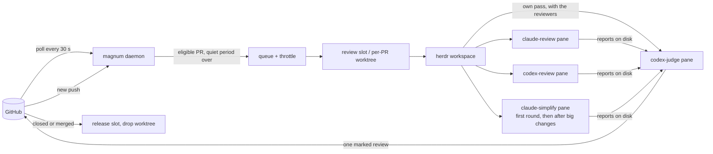

<p align="center">
  
</p>

<h1 align="center">Magnum PR</h1>

<p align="center"><strong>Multiple agents. One review. No drama.</strong></p>

<p align="center">
  <a href="https://go.dev/"></a>
  
  <a href="https://herdr.dev"></a>
  <a href="https://cli.github.com/"></a>
  <a href="LICENSE"></a>
</p>

Magnum reviews your pull requests with the AI coding agents you already use. On every push, several
agents (Claude Code, Codex, droid, omp or any CLI [herdr](https://herdr.dev) can drive) review the PR
side by side, a **judge** agent proves or rejects each finding they raise, and Magnum posts exactly
**one** GitHub review, as you or as a GitHub App. It runs as a daemon on your Mac, on the agent
subscriptions you already have, and every agent works in a herdr pane you can watch or take over.

<p align="center">
  <a href="#quick-start">Quick start</a> ·
  <a href="#how-it-works">How it works</a> ·
  <a href="#what-the-author-sees">What the author sees</a> ·
  <a href="#faq">FAQ</a> ·
  <a href="#configuration">Configuration</a> ·
  <a href="#daily-use">Commands</a> ·
  <a href="#the-pr-board">PR board</a>
</p>

- **Several reviewers, one review.** Each agent has its own prompt, model, credentials and schedule.
  Their findings go to a judge, so the author reads one review with one verdict, not four.
- **Proven or dropped.** The judge reproduces each finding and posts it on the line that must change,
  with the reproduction and the fix. A finding it cannot prove is not posted.
- **Re-reviews that remember.** A push goes back to the sessions that reviewed the PR before: they read
  the author's replies, check the claimed fixes and review only what changed.
- **Real checkouts.** Each PR gets its own worktree, or a warm slot with its own databases for a big app,
  so the agents can run the tests; a closed or merged PR releases it.
- **Your machine, your budget.** No hosted service in between: the agent CLIs you are logged into do the
  reviewing, and GitHub calls go through `gh`. Quiet periods, minimum intervals and daily caps keep a
  burst of pushes from burning your subscription, and a model at its limit can hand over to a fallback.
- **Learns the repository.** The judge keeps notes per repository (how to test it, known pitfalls), and
  an optional daily retro collects what human reviewers caught that Magnum missed.

> [!NOTE]
> **Disclaimer:** this repository is 100% vibecoded and, I'd say, 100% awesome. It saves me hours, and I
> use it every day. If you're happy to let AI review your pull requests, I hope you won't mind that AI
> wrote the reviewer too.

### What the author sees

One review per round: a verdict line first (`Fix 1 problem before merging.`, or `No problems found.
LGTM :shipit:`), then each finding as an inline comment on the line that must change, like this one:

> **[P2] Old Reject error appears in a new chat**
>
> If Reject fails after the user opens another chat, the old error appears there.
>
> **Reproduce** (`app/chat.test.jsx:88`)
>
> ```js
> it("keeps a late Reject error out of a new chat", async () => {
>   const chat = render(<Chat />);
>   api.reject.mockRejectedValueOnce(new Error("timeout"));
>   await chat.click("Reject");
>   await chat.click("New Chat");
>   await flushPromises();
>   expect(chat.text()).not.toContain("timeout"); // fails: the error is shown
> });
> ```
>
> **Fix**
>
> The `catch` changes state before the session check. Check the captured session first.

The author answers on the thread (`fixed`, `not a bug: <why>`, `won't fix: <why>`), and the next push is
re-reviewed against those answers. A reply with no push gets its answer a few minutes later: the judge
re-decides the thread and answers there (an acknowledgement, one sentence with its evidence, or an answer
to a question), or posts a new review when its verdict changes; after two rebuttals in one thread it
stops arguing and leaves the call to the operator. A P1 or P2 problem the judge proved next to the PR's changes that the
PR did not bring is not a finding: up to three go into a collapsed "Found nearby, not this PR's" block
before Checks, one line each, never counted in the verdict (a security one only into `magnum debt`).
A false claim of the description that bears on risk (a ticked "Can be reverted easily" the previous
release cannot keep) is a finding, or one `Description: ✗ <claim>: <why>` line when it harms nothing.
[The judge skill](#the-judge-skill) has the full format.

## How it works



1. **Poll.** One GraphQL query per organization finds new PRs, new heads, new repositories and closed
   PRs, and a second reads the CI state of the watched repositories' open PRs (a CI run that ends does not
   count as a change of the PR). Open PRs that existed before Magnum started are left alone until they
   change.
2. **Throttle.** A new head waits for a quiet period (default 5 min, 15 min after a burst of three
   pushes within 30 min) and at least 30 min since the previous round (2 h for drafts); pushes coalesce
   to the latest head; `magnum review` overrides.
3. **Check out.** Pool repositories (big apps with databases) get one of N provisioned slots; small
   repositories get a worktree next to their clone. Checkouts are detached, so they never collide with
   branches you have open yourself.
4. **Review.** Every role from the pipeline configuration gets a pane: candidate reviewers and the
   read-only simplifier (it proposes simplifications in a report, edits nothing) run in parallel, the
   judge does its own full pass alongside them, a checkout a role left modified is caught and restored,
   and once both ended the judge weighs every report against its own pass.
5. **Post and verify.** The judge posts one review with inline comments and an invisible run marker
   through `magnum post-review`, which checks every inline comment's line against the PR's diff first;
   Magnum verifies on GitHub that exactly that review by exactly that identity exists for that commit.
6. **Repeat and clean up.** New commits re-prompt the same sessions. A push while the reviewers (and the
   judge's own pass) still run restarts them in place on the new head (at most twice per round); a push
   while the judge weighs the reports is noted on the posted review and re-reviewed right after the
   quiet period. A closed or merged PR
   releases its folder after a grace period, with teardown hooks for its databases.

## Quick start

Requirements: macOS (see [Linux](#linux) below), [herdr](https://herdr.dev) 0.9.3+ running, `gh` logged
in and the agent CLIs you want to use (`codex`, `claude`, `droid`, `omp`). MySQL only for a `[[pool]]`
that declares databases: DBngin's server at 127.0.0.1:3306 (root, no password), or any other one that
`MAGNUM_MYSQL_DSN` names (a [go-sql-driver DSN](https://github.com/go-sql-driver/mysql#dsn-data-source-name)
such as `root:secret@tcp(127.0.0.1:3307)/`) in the environment of the daemon and the CLI (the LaunchAgent
does not carry it: a daemon launchd runs sees it only through `mise exec`, from the checkout's mise env);
[mise](https://mise.jdx.dev) only for a pool whose worktrees use it.

```bash
brew install zhuravel/tap/magnum             # built from source by Homebrew
magnum init                                  # ~/.config/magnum/config.toml: your gh login, one repository, who posts
magnum doctor                                # what this setup uses, with the exact fix for each problem
magnum daemon                                # in a second terminal or herdr pane: the daemon in the foreground
magnum review owner/repo#123 --wait          # one review of that repository's PR, start to finish
```

When the review has posted, hand the daemon to launchd (`install` stops the foreground one) and add the
extras you want:

```bash
magnum install --plugin                      # launchd agent + herdr plugin
magnum install --gh --no-launchd             # optional: `gh magnum …`
magnum completion zsh > "${fpath[1]}/_magnum"
```

To upgrade: `brew upgrade magnum && magnum daemon-restart --when-idle` (the daemon keeps running the old
binary until it restarts; `--when-idle` restarts at the first moment nothing is in flight, no round and no
notes curation or retro, `--drain` also stops new rounds meanwhile). `magnum status` and every reply to a
command the daemon answers say when the daemon runs an older build than the CLI or the binary on disk; with
`[daemon] restart_on_new_build = true` the daemon restarts on a new build by itself, at the first tick
nothing is in flight.

`magnum init` refuses to replace an existing config without `--force` (the old file is kept as
`config.toml.bak`); [config.example.toml](config.example.toml) is the same minimal setup to copy by hand.
To post as a GitHub App, answer 2 when init asks who posts: it asks for the App's ids and names the file
to save its private key as, `~/.config/magnum/keys/<app>.pem` (it never asks for the key); `magnum
identities check` verifies the App. A big repository with its own databases gets a pool of warm slots:
add a `[[pool]]` (see below), then `magnum slots provision --count 6`.

## FAQ

**How is this different from a hosted review bot?** Magnum is not a service: it runs on your Mac and
drives the agent CLIs you are already logged into, so reviews come out of subscriptions you already have.
The agents work in a real checkout of the PR (a worktree, or a pool slot with its own databases), so they
can run your tests, and you can watch any of them in its pane. A judge has to reproduce a finding before
it is posted, and later pushes resume the same sessions. The trade-off: reviews happen only while your
Mac is on and the daemon runs, and they spend your own budget.

**What does it cost?** Magnum is free (MIT); every round spends some of the budget of each agent it runs.
The defaults keep that down: a push waits for 5 quiet minutes (15 after a burst), a PR gets at most one
round per 30 minutes (2 hours for a draft) and 12 automatic rounds a day, a push that only touches
comments, whitespace or docs, or only merges the base branch, is not re-reviewed, and a change under 30
code lines since the last review gets a check by the judge alone. With 80% of the Codex budget used,
full re-reviews wait; at 95%, rounds that need Codex wait. `magnum status` shows how fast that budget goes,
`magnum stats` lists the PRs that took the most agent time, and
[triage](#triage-fewer-reviewers-for-a-small-diff) can skip reviewers on a small diff.

**Is it safe to point agents at pull requests?** Reviewing a PR means running its code: the agents run
its tests in the checkout, with the autonomy your agent CLIs allow. Watch repositories whose contributors
you would let run code on your machine; PRs from forks are skipped by default. Magnum treats PR content
as data: PR text never goes into a prompt, the repository's instruction files count only for its
conventions, permission prompts are answered No, hooks a checkout brings are declined, and your personal
GitHub tokens are stripped from review worktrees. [Under the hood](#under-the-hood) has the details.

**How noisy is it?** The judge posts only what it can reproduce, ranks findings by who can reach them (P0
to P3), and offers at most three simplifications, marked optional. Every candidate it rejects is recorded
with a reason, so `magnum stats` shows per reviewer how many findings were raised, posted and rejected,
and why. The optional [retro](#learning-from-other-reviewers) measures the other side: what human
reviewers caught that Magnum missed.

**Why herdr panes and not headless runs?** So you can see what an agent is doing, take it over or answer
it when it is stuck, and so its session lives on: a re-review continues the conversation that wrote the
first review. herdr also gives Magnum pane titles, toasts and a plugin for its popups.

**Can it post as a bot instead of me?** Yes: give it a GitHub App and the App posts, so its approvals and
change requests do not come from your account. See [Identities](#identities-who-posts).

**Does it run on Linux?** Not yet. [Linux](#linux) lists the four macOS-only spots; a small platform
interface around them is the whole job, and contributions are welcome.

## Configuration

Two layers and the App keys:

- The built-in defaults: [config.defaults.toml](config.defaults.toml), embedded in the binary. The
  daemon defaults, the agent kinds and the review roles, every key documented; it names no account,
  repository or path of yours. Editing it changes the defaults after `make build`.
- Your config, `~/.config/magnum/config.toml` (`$XDG_CONFIG_HOME/magnum/config.toml` when that is set;
  `magnum init` writes it): your identities, watches, pools and repos, plus any default you want to
  override. Its `[[watch]]`, `[[identity]]`, `[[pool]]` and `[[repo]]` blocks are appended, a `[[role]]`
  overrides the keys it sets on the role of the same name (or is appended), scalar keys and
  `[kinds.<name>]` entries override key by key. [config.full.example.toml](config.full.example.toml) is
  a complete, working setup (Talkable's) to copy from. `magnum config` and `magnum doctor` say which
  files were read.
- App private keys: PEM files the identity's `private_key_file` names, by convention
  `~/.config/magnum/keys/<identity>.pem` (chmod 600; doctor warns about a looser mode). The older
  `private_key_env` (an environment variable holding the PEM or its path, e.g. from a checkout's
  `.mise.local.toml`) still works; launchd then runs the daemon through `mise exec`.

Magnum keeps its own files where XDG says: the registry, review reports and repository notes in
`~/.local/share/magnum` (`$XDG_DATA_HOME`), logs, locks, the identities' gh config dirs and the tab-bar
file in `~/.local/state/magnum` (`$XDG_STATE_HOME`); `magnum config` prints both. `MAGNUM_HOME=<checkout>`
keeps them in the checkout's `state/` instead, for development.

`--config FILE` (or `$MAGNUM_CONFIG`) replaces the built-in defaults with a complete file of your own.

Besides those, Magnum reads `MAGNUM_MYSQL_DSN` (the MySQL server, see [Quick start](#quick-start)) and
`HERDR_BIN_PATH` (the herdr executable that `magnum open`, `reveal_on_attention` and the plugin commands run;
herdr sets it inside plugin actions, else `herdr` on `PATH`), and hands `[herdr] socket` to the herdr
commands it runs and to the LaunchAgent as `HERDR_SOCKET_PATH`. Every role's pane gets the round's context
in its environment, next to the identity's gh selection (an App's `GH_CONFIG_DIR`, with `GH_TOKEN` and
`GITHUB_TOKEN` blanked) and the slot's env: `MAGNUM_PR_URL`, `MAGNUM_IDENTITY` (`gh` or `app`),
`MAGNUM_REVIEWER_LOGIN` (the login that posts), `MAGNUM_SELF_LOGIN` (the watch's poll login),
`MAGNUM_NO_FINDINGS_EVENT` and `MAGNUM_BLOCKING_EVENT` (the repository's verdict events) and
`MAGNUM_REPORT_DIR` (the round's report directory).

`[daemon] restart_on_new_build` (default `false`): when `true`, every reconcile looks at the binary
launchd starts; once a new one passes its check (`<binary> version` and `<binary> config`, as
`daemon-restart` checks it) the daemon exits at the first tick no round is claiming, reviewing or
verifying, and launchd starts the new build (events `daemon.restart_pending`, then
`daemon.restarted_for_build`). Dispatch is never held for it, and a daemon launchd does not run (started
by hand) only says so: nothing would start it again.

A command handed to the daemon waits up to 30 s for its answer (the daemon answers requests before its
GitHub poll and between the poll's GitHub calls, so one waits for a single call); a request still pending says how to follow it (`magnum logs request:<id> -f`). A request
that reaches a daemon newer than it fails with "this daemon predates <field>: restart it" instead of
running without the field. Without a daemon, `review`, `approve`, `request-changes` and `open` of a parked
PR refuse and queue nothing (they would post or act whenever a daemon next started); the other commands
still queue for the next start, and a request no daemon saw within an hour fails at startup as "expired:
queued while no daemon ran".

The daemon prunes audit events older than `[daemon] keep_events` (default `"30d"`) and handled CLI
requests older than `keep_requests` (default `"7d"`) on every reconcile; `"0"` keeps them forever. The
step rows a checkout resumes from after a crash are the one exception, and only while their subject (a
checkout, named with the head's sha) has had an event inside the window: a subject quiet for `keep_events`
loses them with the rest. `poll_interval` and `reconcile_interval` must be positive, the other waits and
quiet periods (`close_grace`, `push_quiet_period`, ...) and `min_free_disk_gb` not negative, and
`default_repo`, when set, `owner/name`; the config is refused otherwise. Two `[[pool]]` blocks may not
render the same `slot_name` or `slot_path`.

A push that lands while a round's reviewers still run restarts them on the new head, up to
`[daemon] max_round_restarts` times per round (default 2; `0` turns restarts off). The turns it cuts
short are interrupted and their roles prompted again on the new head: an agent reviewer with esc, a shell
role's command with ctrl+c, and the judge's own pass with one ctrl+c, which aborts Codex's turn and keeps
the session with its context (two quit Codex, as for a judge that timed out). All of them get their keys
at once, before Magnum waits for any of them; a shell role's command that still runs 10 seconds after its
ctrl+c gets another, three in all, and a warning names the role when it runs on, since the restart's line
would find its pane busy. When a refusal or a lost judge ends the round instead, the turns still at work
are stopped the same way.
A push that lands while the judge works lets the round finish: Magnum appends "Reviewed <sha>; N commits arrived during
the review, re-review follows" (or, for a small delta, "a short check of those commits follows") to the
posted review and queues the re-review without waiting for `min_rereview_interval`. A PR whose head changed `burst_pushes` times (default 3) within `burst_window`
(default `"30m"`) waits `burst_quiet_period` (default `"15m"`) instead of `push_quiet_period`; a
`[[watch]]` can override all three, and `burst_pushes = 0` turns the rule off.

A watch's `include_own = false` skips the PRs you authored (its author is one of your logins: every gh
identity and every watch's posting identity, the board's "mine"), whichever of your logins opened them,
not only the watch's poll login. A PR you authored waits `[daemon] own_min_rereview_interval` after its
last round instead of `min_rereview_interval` when that is set (default `"0"`: the same interval), say `"2h"` while another
session of yours pushes to it often; an own draft waits the longer of it and `draft_min_rereview_interval`,
a `[[watch]]` can override it, and a review request or `magnum review` skips it like the other timing
rules. The wait names it ("re-review · own PR interval → 16:40").

`magnum snooze <ref>` holds one PR's automatic rounds for a while: `--for` (default `2h`), `--until 18:00`
(tomorrow once past) or an RFC 3339 time; `--off` lifts it. Until then no push, quiet period, re-review,
reply round or delta check starts a round on it (the first review of a new PR included), while
`magnum review`, the board's review keys and a review request on GitHub still run one and leave the
snooze in place. It ends on its own at its time and survives a daemon restart (the registry keeps it); a
round in flight finishes. The board's `z` snoozes the selected PR for 2h after a y/N, and on a snoozed PR
offers to lift it; the state cell says `snoozed → 18:00` (in the wait, or after the state when nothing
waits), the card until when, since when and by whom (`magnum snooze` or the board), and `prs --json`
has `snoozed_until`, `snoozed_at` and `snoozed_by`.

Codex may block an account it takes for a cyber abuser, also when all it reads is your team's own code. So
when a role's turn ends on one of Codex's safety warnings ("This content was flagged for possible
cybersecurity risk", the words "cyber permissive safeguards" or "Daybreak access", or a usage-policy
violation, abuse or a threat named in Codex's own `■`/`⚠`/`ERROR:` line; the kind's `health_patterns`
`refused` list, read from the pane after the turn's prompt and, when the pane scrolled past it, from the
turn's error in the session's Codex rollout, `codex_error_info` `cyber_policy`), the round ends at once,
whichever role it was (the judge's own pass, its candidates turn, a nudge or a continue, a reviewer,
codex-review's output; also when a push cut the stage a moment before): no nudge, no retry, the other
roles are interrupted (the turns of the refused kind first), and the round's outcome and
the PR's last error say "Codex refused the review: content flagged as a cybersecurity risk (codex-judge,
run r-…)". The PR is flagged for good (the refused head, role, run and time) and one toast says so:
magnum never reviews it again, on any head, by itself or when asked (no retry, continue, reply round or
delta check; `magnum review` and the board's `r`/`R` refuse with the reason). The board's state cell and
card read `Codex flagged · never reviewed again`, the card says when and where and how to lift it,
`magnum status` lists the PR among what needs you, `magnum prs` prints `codex-flagged` in STATE and
`prs --json` has `codex_flag` and `codex_flag_detail`; `magnum stats` counts such rounds as `refused`.
Review it by hand. Only `magnum codex-flag clear <ref>` lifts the flag, after a y/N question on a
terminal that names the account risk; `magnum codex-flag set <ref> [reason]` flags a PR by hand (one
Codex warned about elsewhere). A `magnum eval run` case whose replay was refused is recorded in
`<state>/eval/flagged.json` and never replayed (`eval run` says so; delete its entry to replay it).

`[daemon] quiet_hours` (unset by default) holds the costly rounds of every PR during a daily window of
local time, `"HH:MM-HH:MM"` such as `"01:00-07:00"`: inside it first reviews, full re-reviews (a review
request's on GitHub too) and the continue of a judge turn a usage limit paused wait for its end
(`re-review · quiet hours → 07:00`), while their timing rules keep counting. A round of the judge alone
still starts: a delta check of a small push, a reply round, and a re-review of the head Magnum reviewed
(a review request after a reply), each one turn of a few minutes. `magnum review`, the board's and the
picker's review keys still start any round, and a round in flight finishes. Nothing else stops: the poll,
auto-approval, the retro, notes curation, parking and cleanup go on. The window includes its start and
excludes its end, and crosses midnight when the end comes first (`"22:00-06:00"` covers 22:00 to 05:59); a
malformed value or an empty window (`"07:00-07:00"`) is refused when the config loads.

A push whose changes since the last review are only comment lines, whitespace or documentation is not
re-reviewed: Magnum compares the reviewed commit with the new head (one GitHub call), moves the review
to the new head with its verdict, keeps an App's approval and records `pr.trivial_delta`. When such a
commit arrived during the judge's turn, the note on the review says "(comments only), no re-review
needed" instead. `[daemon] skip_trivial_deltas` (default `["comments", "whitespace", "docs", "base"]`,
`[]` = re-review every push) picks the kinds, a `[[watch]]` can override it, and `magnum review` always
runs.

A push that merges the base branch into the PR (or rebases it onto the base) is judged by the PR's own
diff, not by the commits it brings: when the comparison of the reviewed commit with the new head shows a
merge commit or a divergence, Magnum compares the PR's diff against its base before and after the push
(two more GitHub calls, `<base>...<reviewed>` and `<base>...<head>`), file by file, by the sequence of
added and removed lines (context lines and hunk positions, which master's changes move, do not count).
When no file's own change differs, the push is the kind `base` ("base merge only"): the review stands
and `pr.trivial_delta` says, e.g., "the push to 2017f29 only merges master (13 commits, the PR's own
changes unchanged)". A file without a complete patch, or a diff over GitHub's 300-file cap, makes the
comparison incomplete, and the push is measured as any other. A daemon that starts on this rule checks
the PRs already waiting for a re-review once more, on its first poll, and settles those a base merge
queued.

Any other push is measured by the same GitHub call: the changed lines that are code (not comments,
blank lines, whitespace moves or documentation) since the reviewed commit; after a base merge or a
rebase, only the lines that changed in the PR's own diff. An automatic re-review runs after the quiet
period once that delta reaches `[daemon] rereview_min_lines` (default 30) or adds a file; a smaller
delta waits for further pushes, at most `rereview_max_wait` (default `"2h"`) after its first push.
`rereview_min_lines = 0` turns the threshold off, and a `[[watch]]` can override both. A force push back to
an ancestor of the reviewed commit (GitHub: "behind") has nothing to measure, so the threshold does not hold
its re-review.

Such a small delta (more than 0 and fewer than `rereview_min_lines` code lines, no added file) gets a
delta check instead of that wait and a full round (`[daemon] delta_check`, default `true`; a `[[watch]]`
can override it): once the push quiet period (or the burst one) is over, only the judge runs, in its own
session at its `rereview_effort`, without triage or reruns, and its prompt asks for one short review of the
commits since its last one against the PR's purpose and its earlier findings (`delta_check: true`, and the
delta's files listed in `delta-check.json` in the report directory). A modified image or other binary file
(no patch) counts 0 lines there and is named in that list; an added file still means a full round. Pauses,
the re-review interval, the daily cap, capacity and drains hold it as any round, and a forced or requested
round, or one that names roles, runs in full. The board, the card and `magnum status` call it a delta
check (`delta check · quiet → 14:09`, `delta check (4 lines)` on the card's last round and in
`engine.round_start`). A judge whose session is gone (lost, parked by an identity migration, or fresh
sessions requested) checks the delta in a fresh session (`round.delta_check_fresh`): a recovery round of the
judge alone at its `rereview_effort`, whose prompt has it read its previous review and threads before it
reviews just those commits (`delta_check: true` in `judge-recovery.md`); only when no review by the PR's
current or former identities is on record to build on does it become a full recovery round
(`round.delta_check_dropped`). An App's approval of the reviewed commit stands meanwhile (`review.approval_kept_for_check`): the check's approval supersedes it
(`review.approval_superseded`); a check that comments, requests changes, fails or needs attention, a later
push that makes the delta too large, or no check posted within an hour of the check becoming due (after the
push quiet period; quiet hours do not hold the check, and a `magnum pause` counts) dismisses it then, with the reason. `delta_check = false` keeps the wait and the full round.

A re-review of a head Magnum already reviewed (no new commits: `magnum review`, or a review request, to
have it re-read an author's reply) runs the judge alone as a delta check does: no triage, reruns or own
pass, at its `rereview_effort`, in a fresh session too when the old one is gone (`round.same_head_fresh`).
Its prompt says the head is unchanged: re-read the replies and comments since the last review, re-decide
each earlier finding under the reply contract, run no check that review already ran, and post one short
review, headed `Re-review of <sha> (no new commits):`. `round.same_head` records it. A request that names
roles (`--role`, `--simplify`) or asks for fresh sessions (`--fresh`) runs every reviewer as before, and so
does a round whose checkout finds a newer head (`round.same_head_dropped`).

Replies get that round on their own, without a push. The poll reads, for a PR whose activity moved, its
reviews and comments with their authors and their association with the repository (no text): a reply in
one of Magnum's threads by the PR's author or by an owner, member or collaborator of the repository, or a
review or comment by the PR's author (whose agent's "(Claude)" replies are the author's), never one by
Magnum's own logins. Anyone else's reply in a thread (in a public repository anyone may reply), a bot's
without that association, a teammate's review elsewhere or a bot's top-level comment starts nothing; the
next round's judge reads them anyway. When such replies came on a head Magnum reviewed, the PR waits
`[daemon] reply_debounce` (default `"3m"`, `"0"` turns it off) after the last one and at least
`reply_min_interval` (default `"2h"`) after the last such round on that head, and then the judge alone
re-decides the threads (`re-decision · 2 replies → 14:09` while it waits, `reply round (2 replies)` in
`engine.round_start`). The quiet periods, the re-review interval and the daily cap do not hold it, and it
does not count against the cap; a round that only answers does not hold the next push either, whose
re-review interval counts from the last review round. When its verdict and event stay those of its last review, the judge posts
no review: it answers in the threads through `magnum post-review --replies` (an acknowledgement for a
reason it accepts, since resolving the thread is the author's; one sentence with its evidence for a
rebuttal; an answer as deep as asked; nothing where a reply needs none), and the round ends `replied`,
verified by the replies carrying its run's marker (`pr.replied`; the review stands, findings and
auto-approval are untouched). A changed verdict posts one short review, as any round does. A push
meanwhile wins: the re-review of the new head reads the replies too. After two of Magnum's rebuttals in
a thread, an answer marks the thread `stop`: the judge replies there no more, `post-review` refuses to,
and the board flags the PR for you (`pr.stalemate`) until you act on it (`magnum review`, a verdict, a
mute). Replies older than the daemon's first start with this build start nothing on their own; the board
counts them (`↩N`), and `magnum review --replies` (the board's `r` on such a row) re-decides them now.

The rest of the re-review sees a base merge the same way: triage reads the PR's own diff of the files whose
own change differs, the simplify reviewer's rerun measures that change, and the reviewers' and the judge's
prompts say the push merged the base branch, so they compare the PR's diff before and after it instead of
reading the base branch's commits as the PR's.

A review request runs without delay: when someone requests a review from the poll login, from a posting
identity's login (an App's `<slug>[bot]` too) or from a team a `[[watch]]` lists in `request_teams`, or
marks a draft ready for review, the round starts `[daemon] request_debounce` (default `"1m"`) after the
request and the last push. It skips the quiet periods, the re-review intervals, the delta threshold and
the daily cap. Requests are edge-triggered by their time on the PR's timeline: one counts once, and only
when it is newer than the PR's last round start; a review of the head posted after it answers it too.
On a draft a `[[watch]]` skips (`include_drafts = false`), such a request makes the draft eligible for the
one round it starts, and the wait says so (`review · requested on a draft by alice → 14:09`); a later
push to the draft is skipped again until a newer request (GitHub keeps your request after magnum's App
reviews, so the request alone does not count twice).

The daily cap (`max_rounds_per_pr_per_day`, default 12) counts automatic rounds when they start:
requested rounds and `magnum review` never count. A round Magnum itself cut short is refunded
(`round.refunded`): one a shutdown, restart, drain or abort stopped, one that failed before any agent
was prompted or on a prompt this build could not render, and one whose judge ran out of fallback
models. Posted, blocked, timed-out and needs-attention rounds count.

Every PR waiting for a round says why and until when: the dashboard's queue and the PR board show a
compact form (`re-review · quiet → 14:09`, `re-review · cap 6/6 → 00:00`, `re-review · small delta
8/30 lines → 16:40`, `re-review · requested by alice → now`, `delta check · quiet → 14:09`), and the card and
`magnum status <ref>` the full sentence with the command that lifts it (`magnum review <ref>` for the
timing rules, `magnum resume` for a pause). A retry names the attempt to come and what the last one hit
(`re-review · retry 2/3 setup → 22:57`, `retry 2/3 judge lost`, `timeout`, `human active`, ...; a narrow
column drops the cause first). A round waiting on the PR's pinned slot (`magnum open` pins the PR it
restores, `magnum pin` too) reads `re-review · pinned → u` with no error mark, the card says who pinned it
("pinned by magnum open (u unpins)"), and once the round has waited 30 minutes one toast per PR and pin says
"talkable#11792 waits for your pin (magnum unpin …)". A pin never lapses by itself.

A fetch, clone, checkout or dependency step that fails for a reason outside the PR (an SSH key the
agent lost, DNS, a network timeout or refusal, TLS, or the same dependency error on two PRs within ten
minutes) pauses dispatch for everything once, with one toast, and is never charged to the PR. Magnum
probes `git ls-remote` of a watched clone (over HTTPS through gh, like its fetches) after 2 minutes, then after twice as long each time it still
fails (up to 30), and resumes by itself when it answers; `magnum resume` lifts the pause at once.

The `[usage]` section watches the Codex budget, which Magnum reads from Codex's own session files
(`codex_home`, default `$CODEX_HOME` or `~/.codex`) at most once a minute. At `codex_soft` percent
(default 80) automatic full re-reviews wait (`re-review · Codex soft cap` on the board), since a full
re-review costs about twice a first review and finds no more; first reviews, delta checks, re-reviews of
the same head, reply rounds, a review request and `magnum review` still run. At `codex_hard` (default 95)
every round that needs Codex waits until the budget is below it again. `magnum status` and the tab bar
show the gauge (`codex 87%`); `0` turns a cap off.

Once every agent of a reviewed PR has been idle for `[daemon] park_idle_after` (default `"2h"`, `"0"`
never) its sessions are parked to free memory; the next round resumes them. The same goes for a PR whose
review or re-review waits behind `magnum pause`, a drain, the daily cap, or anything else that ends more than
`park_idle_after` from now. Pinned PRs and PRs you typed into within `human_cooldown` keep their agents.

The judge is the exception to resuming. Codex's prompt cache lasts about an hour and a half, so a judge
resumed later re-reads its whole conversation uncached on its first turn (25 of 39 resumed judge turns did,
4.7M tokens in 2.3 days). A judge whose last turn on the PR ended longer than `[pipeline] judge_fresh_after`
ago (default `"90m"`, `"0"` always resumes) starts the next round in a fresh session instead, the way a judge
whose session was lost does: a re-review becomes a recovery, whose prompt has the judge read its earlier
reviews and their threads from GitHub, while the reviewers keep their conversations and re-review the new
commits as usual. Unlike a lost session's, that judge works at its `rereview_effort` and its own pass reviews
the commits since the last review (the whole PR again after a force push); a delta check or a re-review of
the same head runs with a fresh judge at its `rereview_effort` too. A judge still live in its pane is quit
first, which parks its conversation (history kept), and the fresh one starts once herdr no longer lists it.
A continue finishes its paused turn in the old conversation. Each such start is a `round.judge_fresh_cold`
event with the idle time.

### Identities: who posts

```toml
[[identity]]
name = "me"
kind = "gh"                        # your gh login
login = "your-login"
no_findings_event = "APPROVE"
# dismiss_own_stale_change_requests = true   # default: false for kind = "gh", true for "app" (see below)
# review_footer = "_Reviewed {{.Short}} by the team's bot; reply on the thread._"   # a template; default: magnum's (see below); "" = none

[[identity]]
name = "reviewer-app"
kind = "app"                       # a GitHub App: reviews appear as <slug>[bot]
login = "your-app[bot]"
app_id = 123456
client_id = "Iv23liXXXXXXXXXXXXXX"
installation_id = 12345678
private_key_file = "~/.config/magnum/keys/reviewer-app.pem"
no_findings_event = "COMMENT"      # never let a bot approval unlock a merge by accident
```

App tokens are minted from a short-lived JWT and refreshed before they expire; every GitHub call,
including those, goes through `gh api`, so no extra firewall rules are needed. `magnum identities
check` verifies the key, the App, the installation, its permissions and that `login` is the App's
`<slug>[bot]`. A PR follows its watch's identity. When you move a watch to another identity, the next
round of each of its PRs posts as the new one (`pr.identity_migrated`): it parks the sessions the old
identity ran in, reads the old login's reviews and threads as its own history (the previous review, the
replies to answer, the earlier findings), and once its review is posted dismisses what the old identity
left standing, its change requests and an App's approvals, with the old identity's own credentials. It
reads every review of the PR for that (up to 500); a PR with more dismisses nothing and says so in a
`review.former_dismiss_failed` warning. `magnum review --as <identity>` pins one PR to an identity, and a
pinned PR never migrates.

`dismiss_own_stale_change_requests` says what happens to an identity's own earlier REQUEST_CHANGES review
once a newer review of the PR has nothing blocking: `true` dismisses it ("Superseded by the newer magnum
review"), `false` leaves it standing, and a standing change request keeps blocking the author's merge until
a human dismisses it. The default follows the kind: `true` for an `app`, `false` for `gh`, because a `gh`
identity is your own account and its reviews are yours to withdraw; set it to `true` on a `gh` identity to
let Magnum do that. A change request you posted by hand (`magnum request-changes`) and any review posted
after the PR was merged are never dismissed, and a dismissal that fails (a missing permission) only warns.

`review_footer` is the footer Magnum appends to every review the identity posts, once the review is
verified, there for the PR's author (the judge never writes it, and a dry run gets none). Without the key it
is Magnum's: the reviewed commit, then, collapsed under "About Magnum", that the review is automated, that a
P0-P2 thread is answered with `fixed`, `not a bug: <why>` or `won't fix: <why>` (the words the reply
classifier knows; a P3's title says it needs no reply), that simplifications are optional (only when the
watch runs a role aliased `simplify`), that new pushes are re-reviewed automatically (when
`[daemon] quiet_hours` is set, during it only small ones by a short check, the window named with the
daemon's offset from UTC, "03:00-12:00 UTC+3"; drafts only on request when the watch has
`include_drafts = false`), that a thread reply gets an answer without a push,
and whose review request starts a round (the watch's poll login when that is a `gh` identity, else the
posting login); `config.defaults.toml` shows it word for word. It is a Go
`text/template` of at most 2,000 characters, line breaks allowed, with `.SHA` and `.Short` (10 characters)
of the reviewed commit, `.Repo`, `.Number`, `.Login` (the posting login), `.Simplify`, `.Clean` (no
findings and no simplifications), `.Event` (`APPROVE`, `COMMENT` or `REQUEST_CHANGES`), `.PostMerge`,
`.DeltaCheck`, `.QuietHours` (`""` when unset), `.DraftsSkipped` and `.RequestLogin`; `""` turns it off. A template that does not render fails validation and the start check,
like a broken prompt. Magnum starts the footer with `<!-- magnum:footer -->` after a blank line, puts its
own notes ("_Reviewed d4e5f6a; 1 commit arrived during the review …_") above it, and replaces it rather than
adding a second one when it edits the review again; a review whose judge wrote the old footer itself is left
as it is.

### Watches, pools and repos: what to review and where

```toml
[[watch]]
owner = "talkable"
include = ["talkable"]             # repository globs; ["*"] for the whole organization
identity = "reviewer-app"          # who posts
poll_identity = "me"               # who polls
include_drafts = true              # false: a draft waits until ready for review, or a review request for you (one round per request)
skip_bot_authors = true
skip_departed_authors = true       # default: a branch PR by someone no longer a member or collaborator is not reviewed
roles = ["claude-review", "codex-review", "claude-simplify", "codex-judge"]

[[pool]]                           # a big app with its own databases: a pool of warm slots
repo = "talkable/talkable"
main_clone = "~/Projects/talkable"
slot_path = "~/Projects/talkable.review{n}"
min = 12
max = 18
setup = ["bin/worktree-setup"]     # runs once per slot with WT_BRANCH=review<n>
teardown = ["bin/worktree-archive"]
copy_files = [".mise.local.toml", "config/initializers/local.rb"]
```

Repositories without a pool get a worktree per PR (`<clone>__worktrees/pr-<N>`). If the clone has
[worktrunk](https://worktrunk.dev) hooks in `.config/wt.toml`, Magnum runs them with
`WT_BRANCH=magnum-pr-<N>` on create and before removal, so apps that derive databases from the
workspace name get isolated ones. A `[[repo]]` block can declare `setup`, `teardown`, `copy_files` and
`env` explicitly instead. The main clone's `.mise.local.toml` is rendered into the worktree (GitHub
tokens and the `[[repo]]` `strip_env` keys dropped, its `env` set) and its `copy_files` copied when the
worktree is created and again at each round's checkout, as a pool slot's are, so a `strip_env` name or
`env` key added since reaches the next round's panes once the daemon runs with it; the rendered file is
rewritten each time. Its `no_findings_event` and `blocking_event` override the posting identity's
verdicts for that repository, pooled or not. When a PR an App identity approved gets new commits,
Magnum dismisses that approval before the re-review is queued (a small delta keeps it until its delta
check posts, at most an hour); `keep_approvals = true` on the `[[repo]]` (or the `[[watch]]`) keeps it. `prepare` (such as `["bin/rails db:test:prepare"]`) and
`ready` (probes, exit 0 = ready) on a `[[pool]]` or `[[repo]]` run in the checkout before the
reviewers, as `zsh -lc` with the slot's env and within `ready_timeout` (5m) together, followed by a
check that the login shell runs the Ruby the checkout pins; a failure never stops the round, it tells
the judge what will not work. When the files under a pool's `schema_paths` (such as `["db/"]`) differ
from those the slot's databases were last loaded from, or the development database's
`schema_migrations` no longer match them, the pool's `reset_db` commands run first, as a release runs
them (through `mise exec` in the slot, not `zsh -lc`, so the checkout's `.mise.local.toml` does not
override the pool's env) within 30 minutes of their own (with `ready_timeout` starting after them), so the slot's databases
carry the PR's tables and columns. Another round of the same PR, or a PR on the same schema, reloads
nothing ("schema unchanged since <commit>: no reset"), and a release keeps the databases as they are
for the next PR to compare (each reload rewrites every table); `magnum open` reloads them the same way
before it hands a person a free slot. `reset_db_on_schema_change = false` on the `[[pool]]` keeps
`reset_db` to the release, which then loads the base schema, and `magnum doctor` warns about a pool with
`schema_paths` and no `reset_db`. A free slot above a pool's `min` is removed once it has been idle for
`idle_remove_after` (168h when unset or 0; a negative value is refused). A watch's `skip_paths` (path globs where `**` spans
directories, such as `["docs/**", "**/*.md"]`) skips a PR whose changed files all match, while a forced
`magnum review` still runs it. A watch's `manual_repos` (names of repositories it covers, without owner
or pattern, such as `["example"]`) keeps them on the board, in `magnum prs`, the status and the retro,
but starts no round there on its own: not for a new PR, a push or a review request on GitHub. Their PRs
read "skipped · manual"; `magnum review`, the board's `r`/`R` and the picker review one. A PR whose base
branch name has anything but letters, digits, `.`, `_`, `/` and `-` (or `..`, or a leading `-`) is never
reviewed: the judge prompts put `origin/<base>` into a git command when the merge base is unknown, and git
allows `$`, `|`, `&` and parentheses in a branch name that anyone who can push may create. The poll makes
such a PR ineligible ("base branch name has characters magnum does not pass to a shell"), and a round
forced on it fails at its prompts, which refuse such a base. See the comments in `config.defaults.toml` for
every key.

#### Approving as you

GitHub does not count a GitHub App's approval toward a branch's required approvals, so a PR Magnum found
clean still waits for yours. A watch can let Magnum post your own approval on the repositories it names
(off by default):

```toml
[[watch]]
owner = "talkable"
include = ["talkable"]
identity = "reviewer-app"
auto_approve = ["talkable"]        # repository names of the watch, or ["*"]
auto_approve_as = "me"             # an identity of kind gh: your own account
# auto_approve_body = "Approved after magnum's review of {{.Short}}."   # one line; magnum adds its marker
```

Magnum approves as `auto_approve_as`, on the head it reviewed, as soon as the round that posted the review
ends (each tick looks again, for a post to retry or a PR that changed), only when all of these hold:

- its latest verified review is of the PR's current head and leaves nothing to fix before merging: no
  P0, P1 or P2 finding, still-open earlier ones included, by the priorities the judge's result gives them
  (P3 findings and simplifications are optional). Only a result written before it gave them leaves the
  still-open ones to the review's verdict line (`No blocking problems.`, `No problems found…`, `No new
  problems since…`); a line it does not know is not clean;
- the review heard every reviewer of its round: none ran and left no report (wrote none, timed out,
  failed) or was skipped as logged out (the judge then posts `COMMENT`, which an App posts anyway). A
  round continued after a pause counts only the roles its paused round ran;
- the PR is open, not a draft, not muted, not yours, and no round is due or running on it; a dry run or
  a post-merge review never approves;
- its watch would review it on its own: a `magnum review` of a PR the watch's filters leave out (a
  `manual_repos` repository's, a bot's, one with a `skip_labels` label, one whose files all match
  `skip_paths`, ...) is not approved, however clean, nor is a PR Codex flagged;
- it changes none of the review agents' instructions or hooks: no `AGENTS.md`, `AGENTS.override.md`,
  `CLAUDE.md` or `CLAUDE.local.md` at any depth and in any case, nothing under `.claude/` or `.codex/`
  and no `.mcp.json` (the head's file list, as the poller read it), and no session of the head ran
  without the PR's project config (they steer the review agents, and their hooks run on every
  teammate's machine once merged). A PR of more files than GitHub lists (100) is not approved either;
- its head's checks pass, or it has none: while they fail or still run (the rollup `FAILURE`, `ERROR`,
  `PENDING` or `EXPECTED`) Magnum waits, and approves once they pass;
- on GitHub (read just before posting) you have not approved that head, have no review in progress, and
  have not reviewed the PR by hand; a PR with more reviews than Magnum reads (500) is not approved.

When the review, the watch, the agents' files or the checks hold a PR back, the card says why ("magnum does
not approve it as you: its head's checks fail …"; `auto_approve_refused` in `magnum prs --json`) and a
`review.auto_approve_refused` event records each reason once. They do not refuse the board's `A` (or
`magnum approve --as`) on a row that needs you: there you decide by hand.

The body is one line, `Auto-approved: magnum's review of `<sha7>` found no blocking problems ([review](<url>)).`
(or `auto_approve_body`, a template of `.Short`, `.SHA`, `.ReviewURL`, `.Repo` and `.Number`), with a hidden
`<!-- magnum:auto-approval head=<sha7> -->` marker Magnum knows its approvals by. One approval per review:
a post GitHub refuses (403, 422) is not tried again for that review, another failure is tried again after
5 minutes (three posts at most), and one whose answer was lost is found on GitHub instead of posted twice.

New commits alone leave the approval standing (the repository decides about stale approvals): the next
review decides. One that leaves something to fix, on any head, withdraws it (Magnum dismisses it as you:
"magnum's review of <sha7> found blocking problems; this automatic approval is withdrawn ([review](<url>))."),
a clean one leaves it standing without a second approval, and a clean review after a withdrawal approves
again. A withdrawal GitHub refuses (422) reads the review again: one dismissed meanwhile, or gone, ends
there; one GitHub keeps refusing is tried three times, 5 minutes apart, then ends failed with an event and
one urgent toast (dismiss it on GitHub). `magnum request-changes` withdraws your standing approval first,
as you, since GitHub would count it next to the changes request. The approval of a PR that was merged or
closed ends as history (`review.auto_approval_ended`): nothing follows it any more.

Your word wins, for good on that PR: once you review it by hand (an approval, a comment or a changes
request; one you post with `magnum approve` or `magnum request-changes` counts as yours, but not `magnum
approve --as` your account, the board's `A` on a row that needs you, which is followed like these
approvals), or you or anyone
else dismisses one of these approvals, Magnum stops approving that PR as you, and your changes request shows
as `✔ lift your ✗` instead. `magnum review` does not change that; `magnum unapprove --resume <ref>` does
(only what you do from then on counts). GitHub dismissing it as stale on a push does not stop it.
`magnum unapprove <ref>` (y/N on a terminal) and the board's `D` (y/N) withdraw a standing approval and stop
it too.

You see every one: a toast per approval ("approved as you: talkable#12001", with the link) and per
withdrawal, `✔ auto` in the board's STATE and "N auto-approved" in the titles, the card, `magnum prs
--auto-approved`, and "approvals: auto-approved: N today, M standing" in `magnum status`. Each post and
withdrawal is a row of the registry's `auto_approvals` with begin, ok and fail events
(`review.auto_approve_begin`, `review.auto_approved`, `review.auto_approve_failed`,
`review.auto_approval_withdraw_begin`, `review.auto_approval_withdrawn`, `review.auto_approval_withdraw_failed`);
`magnum approve` and `magnum request-changes` write `review.manual_verdict_begin`, `review.manual_verdict`
and `review.manual_verdict_failed`.

### Roles and kinds: the review pipeline

The pipeline is data. Each `[[role]]` is a pane: which agent runs it, with which prompt, model,
effort and credentials, when it runs and how its report is captured. Exactly one role per watch is
the judge.

```toml
[[role]]
name = "claude-review"
kind = "claude"                    # codex | claude | droid | omp | … | shell
prompt = "claude-review.md"        # prompts/<file>; embedded defaults when absent
rereview = "claude-rereview.md"    # new commits since its last report: the delta only
restart = "claude-restart.md"      # a push cut its review short; the round restarted on the new head
effort = "high"
rereview_effort = "medium"         # re-reviews of new commits: fewer, surer findings on the delta
runs = "always"                    # always | first | manual | never
output = "claude-review.md"        # the report the judge receives

[[role]]
name = "codex-review"
kind = "shell"
tool = "codex"                     # codex's login check, pauses and health patterns apply
effort = "high"                    # -c model_reasoning_effort=high, never your global Codex effort
command = "command codex review{{if .Effort}} -c model_reasoning_effort={{.Effort}}{{end}}{{range .MCPOff}} {{.}}{{end}} --base {{if .BaseSHA}}{{.BaseSHA}}{{else}}{{.BaseRef}}{{end}}"   # no MCP servers; the merge base
capture = "stdout"

[[role]]
name = "claude-simplify"
kind = "claude"
prompt = "claude-simplify.md"      # read-only: four angles in parallel subagents, every qualifying proposal, ranked
runs = "first"                     # first review of a PR, then on request (`magnum review --role claude-simplify`, or `--simplify`)
rerun_min_lines = 150              # ...and again once 150 code lines changed since its last run (0 = never)
output = "claude-simplify.md"      # the proposals; no `after`, so it runs alongside the reviewers

[[role]]
name = "codex-judge"
kind = "codex"
judge = true
skill = "{{repo}}/skills/magnum-review/SKILL.md"
prompt = "judge-initial.md"
rereview = "judge-rereview.md"
effort = "xhigh"
rereview_effort = "high"           # re-reviews of new commits; the first review stays at xhigh
max_subagents = 2                  # subagents open at once (0 = none)
timeout = "90m"
```

A role's `timeout` bounds each of its turns (40m, a judge's 90m). `[daemon] reviewer_timeout` and
`judge_timeout` are only the timeouts of a role that sets none: a role's own wins, and the four built-in roles
set theirs, so they change only a role you add without one, and `magnum config` (and doctor) warns when they
change nothing. To give a built-in role another, set `timeout` in a `[[role]]` block of its name.

Non-judge roles run in parallel unless `after = [...]` orders them; the judge runs last and gets every
other role's report. The judge's own full pass needs no report, so by default it starts with the
reviewers: `[pipeline] judge_own_pass = "parallel"` (a `[[watch]]` may set its own) prompts the judge
with `judge-own-pass.md` in the first stage, and it reads the code, runs its checks and writes its proven
findings to `judge-own.md` in the report directory, posting nothing; once every reviewer and that pass
ended, whichever comes last, its usual prompt names `phase: candidates` and that file, and it judges the
reports against it, posts and updates the notes. Over 54 rounds a first review took 32 minutes at the
median (51 at p90), the reviewers 17 and then the judge 15 one after the other; overlapping the own pass
leaves about the longer of the two plus 5 to 8 minutes of judging and posting, some 9 minutes off the
median at about the same usage. The own pass is a run of its own (kind `own_pass`, `round.own_pass`
events, `codex-judge own pass` on the board's card, in `magnum stats` and `own_pass` in `prs --json`;
the state cell reads `reviewers+judge` while both work), bounded by the judge's `timeout`; a push cuts
it short and the restart prompts it again on the new head, naming the head it moved from, and a pass
that left no file only makes the candidates prompt ask for it. Crash recovery counts it with the
reviewers (a daemon restart during it starts the round again), and a usage limit there pauses the round
at the candidates prompt, whose turn the paused round then continues. A judge alone (a delta check, a re-review of the same head, a continued
turn, a round whose reviewers were all dropped) gets one prompt, and `judge_own_pass = "after"` keeps one
prompt after the reviewers.

What the reviewers add is measured, not guessed: in a round with the own pass, `judge` among a posted
finding's sources means the own pass found it before any report was read. `magnum stats` (WHO FOUND THE
POSTED FINDINGS, WHAT THE REVIEWERS ADD; `value` in `--json`) counts, for first reviews, re-reviews and
delta checks (the judge alone), the posted findings by priority found by the own pass, by the own pass
and a reviewer, and by reviewers only (by reviewer), the reviewer-only P0 to P2 per 10 rounds and each
role's median turn. Read the re-review row against its reviewers' minutes: when reviewers alone add
almost no P0 to P2 there, more re-reviews can run as the judge alone (a higher `rereview_min_lines` makes
more of them delta checks) and save the reviewers' turns; the first review row tells the same of first
reviews.

No role may edit the checkout: after each stage Magnum compares HEAD and `git status`
with what the stage found (the judge's own pass included while it works), and a role that changed them
gets a `round.checkout_dirty` warning and the checkout reset to the PR head (`git reset --hard`, `git
clean -fd`) before anything else runs on it.

The judge also knows the repository's other PRs on the same files, since a round otherwise sees only its
own PR (two open PRs fixing one flaky spec in different ways went unnoticed). The Details the poll reads
for a changed PR carry its changed paths (GitHub's first 100; a longer list is marked truncated), which
the registry keeps per PR with the head they belong to, refreshed only when the head moves and kept after
the PR merges. Every judge prompt (the own pass, the candidates phase, a round's one prompt, a delta
check) then names `related.json` in the report directory as `related_prs`, when there is any: the open
PRs (drafts included) and those merged within `[pipeline] related_lookback` (14 days) whose paths overlap
the PR's at the head under review, paths matching `related_ignore` (lockfiles by default) aside, a
`[[watch]]` may set both (`related_lookback = "0s"` there, as in `[pipeline]`, keeps only the open PRs;
unset keeps the pipeline's); an open PR without activity for 30 days (the board's UPDATED) is left out. They
are ranked by shared paths, at most 10 with 20 paths each, and each has its number, URL, state (and merge
time), last activity, head, the shared paths, whether Magnum reviewed it with its last review's URL and
verdict, and how many findings Magnum posted on those paths; no titles, bodies or comments (the judge
reads a PR itself with `gh` when it matters). Every judge prompt records its whole set in
`related-all.json` beside it, and a later round's `related.json` names only the related PRs that the set
recorded for the head the previous review covered lacked or named another way (open or merged, the
shared paths), so a review does not repeat the Related line of the one before; with nothing new there is
no file and no `related_prs`. The skill has the judge name an open PR
that changes the same behaviour (a duplicate or competing fix, conflicting edits, one needing the other)
in one line of its review, raise a finding only when merging both provably breaks something, check that
the PR does not undo what a recently merged one fixed, and record a flaky-test or recurring-bug pattern
in the repository notes. A blind replay (`magnum eval`) never gets the file: it would tell of later PRs.

The reviewers also get the changed files' history, since in 4 of 5 misses traced the changed file's own
recent log named the fix the PR undid. Before the reviewers of each head, Magnum writes `history.json` in
the report directory: each file the PR changes that exists on its base (at most 40, in git's order, paths
matching `related_ignore` aside) with its last 8 commits on `origin/<base>`, each with its short SHA,
date, subject and the PR number a subject ending in `(#123)` names, read with `git log` in the checkout.
A commit the base got after the PR's merge base is marked `after_merge_base` (a second `git log` at the
merge base lacks it): the PR was never tested with it, and a PR once passed alone and failed after the
merge because a newer base commit changed the tool its spec called. The judge's prompts (the own pass,
the candidates phase, a round's one prompt) name it as `history`, the claude-review prompts in one
sentence; the judge reads a commit that fixed the code or mechanism the PR touches (`git show <sha>`), and
a PR that undoes or re-breaks that fix gets a finding; when a commit after the merge base changes what the
PR's code or tests call, the judge runs the affected specs on the merged tree (`git merge-tree`, checked
out in a scratch worktree), and a failure there is a broken build. A restart writes
the new head's; a blind replay reads the logs at its merge base, never anything newer; a continued turn
gets none, and a `git log` that fails or takes more than 2 minutes in all only leaves the prompts without
it (a `round.history` warning).

The judge also sees the head's failing CI checks, since a PR once got LGTM while a check had failed on
that head. When a judge prompt goes out (initial, rereview, continue), Magnum reads the PR's checks from
the registry (`prs.ci_json`, the poller's last Details fetch) and, when they belong to the head under
review and one failed, writes `failing-checks.json` in the report directory (name, state, workflow and
time of each failed check; the PR's workflows name them, so the names stay out of the prompt) and names
it as `failing_checks`. The review's Checks then say for each one whether the PR causes it, from its log
(`gh run view --log-failed`): one the PR causes is a P1 broken build, any other is named as unrelated. A
blind replay never gets the file.

A session role's turn ends when herdr shows its agent idle on two ticks in a row. The judge's ends as soon
as its result file (`codex-judge.json`, the last thing its skill writes) parses with a final status
(`posted`, `replied`, `dry_run`, `blocked`, `identity_error`, `closed`, `stopped` or `error`), and Magnum
checks GitHub at once instead of a minute or two later. The agent may still be printing its last message
then: that work is the turn's, never taken for someone typing into the pane, and Magnum sends the judge
nothing new until herdr shows it idle (it refuses the prompt as busy after 2 minutes). A result file that
does not parse, or holds another status, ends the turn as before: two idle ticks, or 2 minutes after the
file appeared while the agent still shows working. Claude Code also ends
its turn while work it started in the background runs (a command run in the background or moved there by
its timeout, an asynchronous subagent, a skill forked into the background such as `/code-review`) and
resumes when that work notifies it, so for a claude agent Magnum reads the session's transcript too
(`projects/<checkout>/<session id>.jsonl` under the pane's `CLAUDE_CONFIG_DIR`, else `~/.claude`; only what
the run appended) and keeps the turn going while such work has not finished or the agent has not answered
its notification (one `agent.background_wait` event per run). The role's `timeout`, which its prompt names
as the time budget, still bounds the turn: when it passes, Magnum asks the agent once to stop its background
tasks (TaskStop), write its report with what it found and list the checks it stopped as pending
(`round.time_up`), and waits 5 more minutes before it interrupts the agent and counts the report as
`timeout`. A reviewer whose turn ended without a report is interrupted too, and so is one whose turn a push
or the end of the round cuts short. An interrupt does not stop a claude agent's background work, so an
agent whose transcript still shows some is told once more to stop it with TaskStop and do nothing else
(after a push, that the head moved and the next message restarts the review on it), and the warning says
whether it did within 2 minutes; work that
finishes later anyway resumes the agent, and that turn is not taken for someone typing into the pane. If
its transcript shows a prompt typed after Magnum's last prompt to it, a claude agent at work with no Magnum
prompt in flight counts as someone typing into its pane (prompts to the PR wait `human_cooldown`, and an
`agent.human_active` event says until when), and otherwise not. A
reviewer's report starts with its run's marker (`<!-- magnum:run=<run id> -->`, which the prompts ask for
and codex-review's line prints before the output), a report file already there when its role is prompted
is set aside (`<name>.prev`), a report without its run's marker counts as missing, and a continued round
reuses only the reports its paused round verified, so a report written after its run ended never passes
for a later run's.

claude-simplify is Claude Code's `/simplify` made read-only. Four subagents review the diff in parallel,
one angle each: reuse (code the codebase already has), simplification (redundant state, near-copies,
nesting, dead code), efficiency (repeated work, serial independent steps, hot-path blocking) and altitude
(a symptom patched instead of the mechanism). Instead of applying the fixes it writes every qualifying
proposal, ranked, to `claude-simplify.md`: the angle, the lines, what the change removes, the exact current and
replacement lines, the other sites of the same idea and why behaviour is unchanged, then what it skipped
and why. The judge proves each with its own equivalence probe and posts at most three.

With no `[[role]]` at all Magnum runs these four built-in roles, which
`config.defaults.toml` writes out in full; a block named like a built-in role inherits every key it does not
set.

A role whose `runs` is `first` (after its first run) or `manual` runs when asked:
`magnum review <ref> --role <name>` adds it to one round (repeat the flag for several), and a `never`
role is refused. `--simplify` is the shorthand for the role aliased `simplify`, claude-simplify by
default. `magnum roles` prints the effective roles per watch with the prompt file each resolves to, and
`magnum roles --kinds` prints how each agent kind is started, resumed and checked for login, so you can
see what Magnum will type.

`[kinds.<name>]` tables describe how each agent CLI is started, resumed, named, given a model and
effort, checked for login and classified for usage limits (`codex`, `claude`, `droid` and `omp` ship
with defaults; any herdr-supported kind can be added). Prompts are files under `[pipeline]
prompts_dir` (default `prompts/`, falling back to copies built into the binary), so a prompt change is
a file edit, not a rebuild. The daemon loads the prompts and a copy of the judge skill when it starts,
right after checking that its build renders them, so an edit takes effect at the next
`magnum daemon-restart`; `magnum status` counts the files changed on disk since. [prompts/README.md](prompts/README.md) lists every key, every template
variable and examples (a droid simplifier, an omp reviewer, a watch with two roles).

#### Models and effort

Every task is a role, so its model and effort live in its `[[role]]` block in your config; a block
there overrides the built-in role of the same name key by key, so it needs only the keys you change.
`model` picks the model (else the kind's `default_model`, else the CLI's own), `effort` the reasoning
effort of first reviews and `rereview_effort` that of re-reviews of new commits. Claude roles get both as
`--model` and `--effort` at launch and on every resume, so a role without them runs at your own Claude
Code `model` and `effortLevel` settings, and a resumed conversation keeps the model it started on. `codex-review` is a
shell role that runs `codex review`: its command passes the role's `effort` (`high` by default) as `-c
model_reasoning_effort=…`, so it never runs at the effort of your global Codex config (it did, at `xhigh`,
for 23% of the Codex spend), and its `args`, appended after, take a model or another effort as Codex config
overrides. A role you can do without is turned off with `runs = "never"` (or `"manual"`: only when you
ask). To spend less as a subscription runs low, for example:

```toml
[[role]]
name = "codex-judge"
model = "gpt-6.1-sol"                # a cheaper Codex model
effort = "medium"
rereview_effort = "low"

[[role]]
name = "claude-review"
model = "sonnet"
effort = "medium"

[[role]]
name = "codex-review"
args = ["-c", "model=gpt-6.1-sol", "-c", "model_reasoning_effort=medium"]

[[role]]
name = "claude-simplify"
runs = "never"
```

`magnum roles` prints the effective model and effort of every role, and `magnum daemon-restart --drain`
applies a change once the rounds in flight end.

A role's `max_subagents` caps the subagents its agent may have open at once, through its kind's `subagents`
args (Codex: `-c agents.max_concurrent_threads_per_session=N`; `0` turns them off with `-c
agents.enabled=false`; a kind without those args ignores the key). The judge defaults to 2: on its own it
started 53 subagent threads in 36 sessions, 27% of the Codex spend, two of them over a million tokens on one
PR. Codex caps the threads open at once, not how many a session starts in all.

Magnum's Codex sessions (the judge, `codex review`) run on your own Codex setup: `$CODEX_HOME`'s login and
session files (which Magnum resumes and reads for usage), its `config.toml` (hooks and plugins) and your
global `AGENTS.md`, but without your MCP servers. Codex merges `-c` tables into your config, so a server
goes off only by name: every launch and resume of the judge, and `codex review`'s line, reads the
`[mcp_servers.<name>]` tables of the `config.toml` Codex reads (in the `CODEX_HOME` of the kind's or role's
`env`, else `$CODEX_HOME`, else `~/.codex`) and passes `-c mcp_servers.<name>.enabled=false` for each one
not already disabled there. Codex's built-in apps connector (the `codex_apps` server of ChatGPT's
connectors, which a `codex review` with every server off still searched the web through) is no such table:
the same launches pass `-c features.apps=false` once, and `-c skills.include_instructions=false`, which
keeps your skills list (about 5,900 tokens) out of every turn: the judge reads the skill its prompt links
(`[kinds.codex] mcp_strict`; `[]` keeps both on).
`mcp_allow = ["docs"]` keeps the servers it names, `mcp_off = false` keeps them all, the connector and the
skills list; a
name that is no TOML bare key (letters, digits, `_`, `-`) stays on, with a log line. A custom
codex-review `command` needs `{{range .MCPOff}} {{.}}{{end}}` for the same. Magnum never
gives its sessions a `CODEX_HOME` of their own (the login, the session files, the folder trust and the
hooks live there), so your global `AGENTS.md` still loads; the judge skill tells the judge that your
instructions for interactive work (status lines, usage checks, delegation skills) do not apply in a
review.

The checkout's own `.codex/` is project config Codex loads for a trusted folder (Magnum trusts its
checkouts): MCP servers it starts or sends tokens from the environment to, hooks, rules, settings. A PR
controls it, so when the files under the checkout's `.codex/` differ from the PR's merge base (the PR's
commits, files a round left there, or git cannot tell), every launch and resume of the judge and `codex
review`'s line pass `-c projects={"<checkout>"={trust_level="untrusted"}}` (`[kinds.codex]
project_untrust`): that session treats the checkout as an untrusted folder and loads none of its `.codex/`,
nothing is written to your config, and Magnum answers Codex's "Folder access" with "Open restricted".
Codex then also leaves the checkout's `AGENTS.md` out of its instructions. The `AGENTS.md` (or
`AGENTS.override.md`) at the checkout's root is the project's instructions Codex loads, so a PR that changes
it is declined too; when the instruction files are all it changes, the session gets `-c
project_doc_max_bytes=0` instead (`[kinds.codex] project_docs_off`): Codex reads no project `AGENTS.md`
and loads the rest of the team's `.codex/`, the checkout trusted. Codex loads no `AGENTS.md` below the root
(Magnum starts it at the root), though its model may read one as a file, as `codex review`'s own rubric
asks for the files a diff changes. An `agents.codex_project_declined` event records it, the board's card
says "Codex ran without the PR's AGENTS.md changes (its sessions loaded no AGENTS.md)", naming the files,
and the review's Checks of a round with a Codex role (the judge included) say the same in one line, which
Magnum writes (`project_checks`); the judge still reads the files as data.
Untracked log files are no change: a file under `.codex/log/` or `.codex/logs/`, or one named `*.log` or
`*.log.<digits>`, which a team's own hook may write into every checkout and Codex never loads; any other
untracked file, ignored or not, still counts, and so does a tracked log. The paths match in any case:
macOS's filesystem ignores case (and folds Unicode, so `ſ` is `s`), so Codex opening `.codex/config.toml`
reads a `.Codex/config.toml` a PR added, and Claude `.claude/` and `.mcp.json` likewise. A PR that leaves `.codex/` alone gets the base branch's
(the team's) project config as before; `project_mcp = "off"` turns its MCP servers off too, but for
`mcp_allow`. Not covered: a Codex TUI that attaches to a running Codex app-server daemon hands it only
some of its `-c` flags (Codex 0.160), so the MCP servers and the trust may then not be Magnum's to set; a
session herdr restores by itself starts without Magnum's flags.

Claude Code does the same with the checkout's `.claude/` and `.mcp.json`, which a PR controls too: the
project settings (hooks, which run outside any sandbox, `env`, plugins, permissions), `settings.local.json`,
the MCP servers of `.mcp.json`, skills, commands, agents (Magnum trusts its checkouts and skips Claude's
permission prompts), and the instruction files: the `CLAUDE.md` and `CLAUDE.local.md` of the root and of
each directory Claude reads files in, and where the project has no `CLAUDE.md` its `AGENTS.md` files
instead (Claude Code 2.1.292). When the files under `.claude/`, `.mcp.json` or a `CLAUDE.md`,
`CLAUDE.local.md` or `AGENTS.md` in any directory differ from the PR's merge base (or git cannot tell), every
launch and resume of a claude role (claude-review, claude-simplify) passes `--setting-sources user`
(`[kinds.claude] project_untrust`): the session loads your user settings, skills, agents and `CLAUDE.md`
and nothing of the checkout's. A `CLAUDE.md` that links to `AGENTS.md` (or an `AGENTS.md` that links to
`CLAUDE.md`, for Codex) loads the PR's file through the link: Magnum compares what an instruction file at
the root links to as well. An ignored instruction file below the root (a package's `AGENTS.md` in
`node_modules/`) is no change. An `agents.claude_project_declined` event records it, the board's card says
"Claude ran without the PR's CLAUDE.md changes (its sessions loaded your user settings only)", naming the
files, and so does the review's Checks of a round with a Claude role. Untracked logs under `.claude/` are no change, as
for Codex (a team hook's gitignored `.claude/log/tool_use.log` would otherwise decline every later
session); a gitignored `settings.local.json`, skill or anything else still declines. A PR that leaves both alone keeps the team's project config. Claude Code reloads
its settings and skills while it runs, and loads a `.claude/settings.json` a later commit adds, so a
Claude session that started with the project config loaded is quit (its conversation parked) before
Magnum moves the checkout to a new head that changes it, at a round's start and at a restart after a push,
and resumed once the new head is checked out; one that works or is blocked holds the round instead. The
checkout's fetch runs first, and the head it fetched decides: by the PR's file list when the list is
complete and of that head, else (a PR of more files than the list holds) by git, the files that head
changes there since its merge base with the base branch; a git that cannot tell quits the session. Not
covered: a nested `<dir>/.claude/skills/` or `.claude/rules/` (Claude loads them once it works on files
there), a team `CLAUDE.md` that imports (`@path`) another file the PR changes, an instruction file below
the root that links to one, a team hook that runs a script outside `.claude/` the PR changes, and an agent
that checks another commit out in the checkout.

Magnum's Claude sessions (claude-review, claude-simplify, and the retro's classifier and the notes curator
when they run Claude) run on your own Claude Code setup too: its login, your user settings (hooks, plugins,
permissions), skills, agents and `CLAUDE.md`, and the checkout's project config as the paragraph above
says, but without MCP servers. Claude Code turns servers off only all at once, so every launch and resume
passes `--strict-mcp-config` with no `--mcp-config` (`[kinds.claude] mcp_off` and `mcp_strict`): none of
your user, local or plugin servers, the checkout's `.mcp.json` or claude.ai connectors load. They cost
tokens in every turn, and a session's servers stayed in its pane's foreground after the agent was asked to
exit, so quitting it before a checkout failed. `mcp_off = false` loads them again; to keep a few, write them
to a JSON file (`{"mcpServers": {...}}`) and add `"--mcp-config", "/absolute/path.json"` to `mcp_strict`
(`mcp_allow` names Codex servers only). A running session keeps what it started with until its next start.
Under a `managed-mcp.json` Claude Code refuses `--strict-mcp-config` and exits: set `mcp_off = false` there.

A session whose model hits its own limit switches to the kind's next `fallback_models` entry by
itself (Claude: `["opus", "sonnet"]`) and back once the limit lifts.

#### Triage: fewer reviewers for a small diff

A one-line fix does not need every reviewer. With `[triage] enabled = true`, before a round starts its agents
Magnum asks a cheap model which reviewers the round's diff needs: Claude haiku by default, or any CLI that reads
a prompt on stdin and prints its answer (`command`, with a Codex line in `config.defaults.toml`). The limits are
Magnum's, not the model's. Only a first review or re-review whose diff has at most `max_lines` changed lines
(default 120, added plus deleted; a re-review counts the commits since the last review, or, after a base merge
or a rebase, the PR's own diff of the files whose own change they altered) is asked about, bigger
rounds run every role. The judge always runs, and the model can only remove roles that have a `summary`, the
one-line description of what a role checks (the built-in reviewers have one, a role without one always runs). A
round that names its roles (`magnum review --role`), a continued round and an eval are never triaged. Anything
that goes wrong (a missing or failing command, a `timeout`, an answer that cannot be read, a diff GitHub cannot
give in full) runs every role. The prompt, `prompts/triage.md`, tells the model that the diff is data, not
instructions, and never contains the PR's title or description. Each decision is a `round.triage` event on the
PR (`magnum logs <ref>`): the diff size, what runs, what was skipped and the model's reason, or the warning that
says why every role ran.

```toml
[triage]
enabled = true
max_lines = 120
command = ["claude", "-p", "--model", "haiku", "--tools", "", "--no-session-persistence"]   # prompt on stdin, answer on stdout

[[role]]
name = "claude-simplify"
summary = "simplifications and refactors of the changed code"   # what the model is told the role does
```

### The judge skill

`skills/magnum-review/SKILL.md` is the judge's method: review the whole PR, treat every candidate
report as a claim to prove or reject, attach findings to changed lines with reproduction and fix,
post one review (`REQUEST_CHANGES`, `COMMENT` or the configured no-findings event), verify it, and
write a machine-readable result. It reads every caller of a method whose behaviour changed, fixtures,
generators and scripts included, lists what a replaced mechanism (DELETE for TRUNCATE, another library)
did implicitly and checks each effect against those callers, probes the real engine while it looks,
weighs the candidates a reviewer rejected itself, replays a chance test failure to state its rate, and
counts developers' time (local runs that diverge from CI, a new flaky test) as harm. It reads the
changed files' recent commits (`history`) and checks that the PR does not undo or re-break an earlier
fix, and it verifies the description's claims that bear on risk (a ticked "Can be reverted easily",
"No migrations" or "Covered by tests", a stated scope or behaviour) at the reviewed head. A PR that closes
an access hole gets every parameter of that request traced to its writes, dynamic dispatch included, and
a hole left there is the PR's finding, not a pre-existing one; parallel copies of the code the PR edits
(one file per client or provider) are compared for a guard one lacks; a delete of records thought
unsaved is checked against every path that saves them; and a case called a known edge case or rare gets a
check of how often real traffic reaches it, while an input no caller produces and no user can send is P3
at most. It runs the affected specs on the merged tree when a base commit after the merge base changes
what the PR calls, and gives each of the head's failing checks (`failing_checks`) a Checks line. A
finding its earlier reviews missed on code the PR did not change since is posted as new, its title
ending with `(missed earlier)`. In re-review mode magnum hands it the threads its login started with
every reply classified by its first clause, after an opening "Good catch", "Valid" or "Noted" (`fixed`,
`not a bug`, `won't fix`; a reply that scores the fix below zero, or says "not worth it" or "we accept the
risk", declines it, as do "Low priority" with no fix after it, "Deferred", "left open" and "No guard for
now"); the judge decides a reply by what it does, not by that hint, accepts a fix
only when the code shows it, honours an answered finding unless it proves the reason wrong (then it
says why in one sentence in that thread), and lists only what changed since its last review: findings
now fixed or answered, findings still open despite a reply or a commit, and new ones; the unchanged open
findings are one count with a link to the previous review.
The result records every finding the judge weighed with a short title, its sources (`judge` only when
its own pass found it, not when it confirmed a report) and, for a rejection, a reason code
(`outside_diff` only for a problem neither in nor caused by the lines the PR changes), marking
`nearby` a pre-existing P1 or P2 it proved in or near the code the PR changes (the claude reviewers
report such a problem marked `nearby` instead of leaving it out); `magnum stats` reports
them per role and `magnum debt` lists the nearby ones across PRs. Its finding counts and posted entries
are only what the review posts as new: an earlier finding still open counts in
`previous_findings.open`, by priority (P0 to P3), never as posted again, so each finding counts once,
in the round that first posted it, under whoever found it then; magnum's summary of the round
(`open_counts` next to `open` in `status --json`) reads those priorities, an older result giving only
the number. A missing report gets its Checks line with `(machine)` as the reason when the review
machine caused it, and a check the machine blocked reads `skipped (machine)` (the detail goes to
`environment_failures`); a flaky test the PR adds may carry its finding. A security finding is proved
with the repository's own tests (a focused or request spec, through `db_lock`), never with attack tooling
(browser automation forging cookies or sessions, exploit or payload scripts, scanners, network tools
against hosts), which the agent CLI's provider may flag as abuse. The skill runs unattended: it never stops to ask a human
(whatever an instruction file says), runs no usage checks, and ends with one line (the review URL or the
blocker) and a short `MAGNUM_RESULT` line: the status, run, review, verdict and counts of its result
file, which magnum reads only when the file is missing. The rules of rare rounds (a blind replay, a
post-merge review, former logins, claude-simplify's proposals) are in the prompts of those rounds, not in
the skill every session reads.

The judge writes only the findings; `magnum post-review` does the posting. Its `<magnum>` block names
the command as `post_review`: the daemon's own binary with every flag filled in (repository, PR, head,
run id, reviewer login and former logins, the identity's gh config directory, `--dry-run` in a dry
run), and the review file `review.json` in the report directory. The judge writes
`{"event": …, "body": …, "comments": [{"path", "line", "side", "start_line", "start_side", "body"}]}`
there and runs the line, which:

1. checks the file: a known event, bodies that are not empty and fit GitHub's 65,536 characters, sides
   `RIGHT` (the default) or `LEFT`, a `start_line` before `line` on the same side, no
   `<!-- magnum:footer -->` (Magnum appends the footer), no local path (one starting `/private/`,
   `/var/folders/`, `/Users/` or `~/`, or a `/tmp/` path that is there on this machine, as the judge's
   scratch files are; outside a repository path or URL; the problem names it, in a reply too), and appends
   the run marker when the body lacks it;
2. checks every inline comment against the PR's diff as GitHub shows it (`pulls/{n}/files`, both sides,
   context lines included; a multi-line comment within one hunk). A file GitHub sends without a patch
   is checked against `git diff` from the merge base in the checkout; a line neither can check is kept
   and GitHub decides. A PR that moved on while the judge worked is checked against its base and the
   reviewed head. Any line off the diff posts nothing and exits 2, listing each bad comment with the
   valid line ranges of its file on that side;
3. looks for a review by the reviewer login (or a former login) that already carries the run's marker,
   and posts nothing when there is one (`already_posted`); it reads every review of the PR (up to 500),
   and a PR with more whose reviews read carry no marker posts nothing either (`error`: the review may be
   among the later ones);
4. posts the review once on the reviewed head, the JSON on gh's stdin: a 422 refusing a verdict on the
   identity's own PR is retried once as `COMMENT` (`event_downgraded`), another refusal is `rejected`,
   and a failure whose outcome is unclear is settled by looking for the marker again;
5. reads the review back: author, commit, state, marker and the number of inline comments.

It prints one JSON object on stdout (`posted`, `already_posted`, `dry_run` with the `planned_review`,
`invalid`, `invalid_anchors`, `rejected`, `error`, `readback_mismatch`) and one line on stderr; exit 0
is posted, already posted or a dry run, 2 is the judge's file to fix, 1 anything else. It loads no
config, opens no registry, never talks to the daemon and writes no file, so it works from the judge's
pane whatever the daemon is doing.

Every round after an earlier review gets the same line with `--replies replies.json` as
`post_replies`, and the judge posts every thread reply through it: a rebuttal after its review, or, in
a reply round (replies with no push, see Re-reviews), the answers it posts instead of a review. It
writes `{"replies": [{"comment_id", "kind", "body"}]}` there
(`kind`: `ack`, `rebuttal` or `answer`; `comment_id` the thread's first comment, from the threads file),
and the command checks each entry (a known kind, a body without any `<!-- magnum:` marker, unique
threads), checks each thread was started by the reviewer login (or a former login) and is not one where
it already rebutted twice, then posts each reply once with `<!-- magnum:reply run=<run id> kind=<kind>
-->` appended (a reply of the same run already in the thread is reported, not posted again), and prints
`replied` with the replies (a dry run prints them as planned). Exit 2 means the file needs fixing. A blind replay (`magnum eval`) passes `--local-base <base_sha>`: the
lines are checked against the local diff of the pinned range and nothing is read from GitHub. Magnum's
own verification is unchanged: it still finds the review on GitHub by its marker.

The roles of a round share the slot's databases, and the judge's own pass runs its checks while the
reviewers run theirs. So every role that runs tests gets `magnum db-lock` in its prompt (the judge as
`db_lock` in its `<magnum>` block, the claude prompts in one sentence): the daemon's binary with
`--checkout <slot> --role <role> --`, followed by the command that touches the databases (specs, `rails
runner`, rake tasks, migrations). It holds an exclusive lock per checkout while the command runs (a
flock on `db-locks/<checkout>-<hash>.lock` in the state directory, so a holder that crashes or is killed
frees it), passes the command's output and exit status through, and makes the other roles wait: a
waiting role prints once `db-lock: waiting for <role> (<command>) since <time>`. After `--timeout`
(default 20m) it gives up with exit 75 and `db-lock: waited <timeout> for <role> (<command>); the check
did not run`, which the skill treats as a check that did not run, never a finding. Exit 125 is db-lock's
own failure (no command, a checkout it cannot find), 126 and 127 a command it cannot start, 128+n one a
signal ended. Without `--checkout` it locks the git work tree it runs in. Like `post-review` it reads no
config and no registry. codex-review needs none of this: it is a static review, sandboxed without Redis
or databases, and the skill does not count the checks it could not run as machine failures.

What an author gets, every review alike:

- **One verdict line** first: `Blocking: N problem(s) must be fixed before merging.` (a P0 or P1 among
  them), `Fix N problem(s) before merging.` (P2) or `No blocking problems.` (only optional ones), with the
  optional ones counted; with nothing at all, `No problems found. LGTM :shipit:` (a re-review: `No new
  problems since a1b2c3d. LGTM :shipit:`; post-merge: `No problems found in the merged commits. :shipit:`).
  A re-review puts `Re-review a1b2c3d → d4e5f6a:` before it. No GitHub event names, no notes on
  the process. The event follows `no_findings_event` and `blocking_event`, except that a round where a
  reviewer left no report (a usage limit, a timeout) never approves: its no-findings event is `COMMENT`,
  and Checks names the missing reviewer. A PR the posting login (or the human behind it) opened gets
  `COMMENT` both ways, as a post-merge review does.
- **Each finding on the defective line**, the code that must change: a title that states the wrong result;
  the trigger, who can produce it and the concrete consequence; a test that proves it as a fenced block
  naming its spec file and line (the test the judge ran, never only its output); **Fix** with the code
  cause, one smallest safe change and the behaviour it must keep, any code in it run with the reproduction
  before it is posted (a `suggestion` is only ever the code fix). A P3's title ends "(optional, no reply
  needed)"; a re-review's finding in code written to fix an earlier one ends "(in the fix for <earlier
  title>)".
- **The description's claims checked**: a false claim that bears on risk (a ticked "Can be reverted
  easily" whose previous release cannot run on the new schema or the jobs queued meanwhile) is a finding
  at its priority; one without impact is one body line, `Description: ✗ <claim>: <why>`; a true claim
  gets no line.
- **Priority by reachability**: P2 is a defect that real use or an attacker reaches, with harm beyond the
  triggering request; one that only crafted input or a stack of unlikely preconditions reaches, harming
  only that request, is P3. A size or timing trigger states its threshold and why real data reaches it.
- **At most three simplifications**, the most substantial, one comment per idea, titled
  "**Simplification** (optional, no reply needed)", each backed by an equivalence probe listed in Checks.
  Each removes something a reader must hold (a branch, helper, flag, duplicated block), never only renames
  or moves code, and none touches authorization, sandboxing, money or usage recording, or concurrency code
  unless it removes a defect-prone construct; a re-review suggests them only on lines changed since the
  previous review.
- **The identity's footer** last, appended by Magnum (`review_footer`, see Identities): the reviewed commit,
  then a collapsed "About Magnum" that says how to answer and what starts the next round.

A clean review, as GitHub receives it (the comments do not render):

```markdown
No problems found. LGTM :shipit:

<details><summary>Checks (2 run)</summary>

- `bin/rspec spec/models/order_spec.rb`: 42 passed
- `bin/rubocop app/models/order.rb`: no offenses

</details>
<!-- magnum:run=r-20261006T101500-1a2b3c head=d4e5f6a -->

<!-- magnum:footer -->
**Reviewed commit:** `d4e5f6a7b8`

<details><summary>ℹ️ About Magnum</summary>

Automated review by [Magnum](https://github.com/zhuravel/magnum). Reply on a P0-P2 thread with `fixed`, `not a bug: <why>` or `won't fix: <why>`; simplifications are optional. New pushes are re-reviewed automatically (during 03:00-12:00 UTC+3 only small ones, by a short check). A thread reply gets an answer without a push, and a review request for `your-login` starts a round.

</details>
```

One with findings starts with the verdict and the finding titles, and ends the same way:

```markdown
Fix 1 problem before merging. 1 optional: 1 simplification.

- [P2] A retry sends the confirmation email twice

<details><summary>Checks (2 run)</summary>

- `bin/rspec spec/jobs/confirmation_job_spec.rb:31`: 1 failed, the reproduction on the finding
- `bin/rspec spec/models/price_spec.rb` (equivalence probe): 12 passed

</details>
<!-- magnum:run=r-20261006T113000-4d5e6f head=e7f8a9b -->

<!-- magnum:footer -->
**Reviewed commit:** `e7f8a9b0c1`

<details><summary>ℹ️ About Magnum</summary>
…
</details>
```

## Daily use

| Command | What it does |
|---|---|
| `magnum init [--force]` | Write `~/.config/magnum/config.toml` for this machine from three questions: your gh login, one repository, who posts (your login or a GitHub App). |
| `magnum prs [--repo …] [--view all\|magnum\|mine\|ready] [--sort updated\|last-review\|reviewer-activity\|requested\|changes\|state] [--desc] [--all] [--needs-me] [--auto-approved] [--json] [--limit N]` | The PR board: every watched PR with its last review, each reviewer's verdict (with staleness), when a review was last requested (and whether of you), what changed since the last review, assignees; then the PRs merged or closed in the last day (`[board] recent_closed`), flagging one merged before Magnum reviewed its last push. `--view` keeps what Magnum reviewed, what is yours or what is ready to merge; `--desc` (the default) puts the largest first and `--desc=false` reverses the order, `--limit` caps the rows (0 = all). Live screen on a terminal, table or JSON otherwise: snake_case keys, times in RFC 3339 (left out while unset), durations in seconds (`total_seconds`, `duration_seconds`), `null` for a part a PR has none of and `[]` for an empty list; UPDATED is `activity_at`, the PR's last activity, and GitHub's own updatedAt is `github_updated_at`. `--needs-me` lists only the PRs Magnum approved that GitHub still blocks on your approval (below); `needs_me` (`approve`, `lift` or `""`) and `review_decision` (GitHub's) say it in the JSON, and `approve_as` whom the board's `A` approves such a PR as (the watch's `auto_approve_as`: its `identity`, `login` and the `refusal` that would stop it now, `""` when none; `null` without one). `--auto-approved` lists only the PRs Magnum approved as you (Approving as you); `auto_approved` (its `review_id`, `head`, `url` and `at`, or `null`) and `auto_approve_stopped` (why Magnum no longer approves the PR as you, or `""`) say it in the JSON, as does `auto_approve_refused` (why it does not approve the head as you although the review left nothing to fix, or `""`), `auto-approved` in the printed STATE. `pending_replies` counts the replies on Magnum's review its judge has not re-decided (", 2 replies" in the printed LAST REVIEW) and `stalemate_threads` lists the threads where it stopped arguing (`stalemate` in the printed STATE). As on the board, the printed STATE names a snooze (`snoozed→18:00`) and FINDINGS the earlier findings still open when the review posted none new (`blocking 3 open`). |
| `magnum status [<ref>\|<slot>] [--all] [--sizes] [--json] [--watch]` | Daemon, slots, queue, pauses; a PR's detail card with its review history and the last round's stage timings. The codex line says how fast the Codex budget is spent, the share used over the share of the window elapsed, and when `[usage]` codex_soft and codex_hard come at that pace if before the reset ("pace 2.8x: 80% Oct 7 13:30, 95% Oct 8 09:10"; `pace`, `soft_at` and `hard_at` in the JSON); the daemon toasts once per window when codex_soft would come before the reset (not in the window's first tenth, when one burst is no pace). The notes line sums up the repositories with notes, the proposals to review and those past a limit (`magnum notes` lists them). A queue line adds, as the board does, the PR's snooze and the earlier findings still open (`· snoozed → 18:00 · 3 open`; `snoozed_until` and `open` in the JSON), and a PR's card its snooze on the state line. A `machine:` line per repository and command sums up what the judges reported of the review machine in the last 24 hours (`round.environment`: "machine:  6 rounds of talkable: `bundle exec rspec`: no test database for the worktree, last 09:24", a test file's path left out of the command; `machine` in the JSON); a command that fails in 3 rounds of one repository toasts once a day. `--watch` is the live dashboard (`tab` flips to the PR board). |
| `magnum stats [--since 7d] [--repo owner/name] [--json]` | Review statistics per local day and repository over a window (`--since` takes `7d`, `36h`, `90m` or a date; default 7d): rounds started and how they ended, findings posted by priority (only the new ones: a re-review's still-open earlier findings are not counted again), median and p90 durations per role and per round, how many findings each source raised, had posted, had posted alone or had rejected (with reason codes), model switches, denied prompts and round restarts, and the top 10 PRs by agent time (the sum of their runs' durations in the window, the rounds and the share of all agent time; `top_prs` in the JSON), so a PR burning the budget can be muted; and, for first reviews and re-reviews with the judge's own pass and for delta checks, who found the posted findings (the own pass, the own pass and a reviewer, reviewers only), the reviewer-only P0–P2 per 10 rounds and each role's median turn (`value`; see [Roles and kinds](#roles-and-kinds-the-review-pipeline)). |
| `magnum eval run\|score\|list\|show` | Measure a prompt, skill or model change: `run` replays the PRs with known defects in `~/.config/magnum/eval.toml` (see `eval.toml.example`) at their pinned heads as blind dry runs and reports, per case, the seeded defects the planned review found, at what severity, and its other findings (noise), next to the previous run. `score` re-scores a run after a match rule is fixed, without the agents. |
| `magnum merge-check <repo> --merged <commit\|#PR> --pr N [--slot NAME] [--keep] [--command CMD] [--timeout 1h] [--json]` | An experiment, run by hand (the daemon never runs it): do PR N's specs still pass once another PR is merged? It holds a free pool slot of `<repo>` (`--slot` names one; never a pinned or held slot or one holding a PR) with the hold reason `merge-check`, which `magnum slots` and `magnum status` show and the daemon, which may keep running, leaves alone. It merges N's head into the merged commit (`--merged`: its id, or `#M` for the merge commit GitHub reports for PR M); a textual conflict is the answer `conflict`. Otherwise it checks the merge out with the slot's checkout steps and readiness (the databases reloaded when they carry another schema, the prepare and ready commands) and runs, through the slot's db-lock line, the spec files N changes, those the merged commit changes and those of the Ruby files it changes (`app/models/a.rb` → `spec/models/a_spec.rb`), with `--command` (default `bin/rspec`) and its JSON formatter. The files of the failing examples run again at N's head alone: an example that does not fail there is a `clash`, one that does `already_failing`. It prints the failing examples with their verdicts and writes `result.json`, the runs' reports and output under `~/.local/state/magnum/merge-check/` and a `merge_check.result` event on the PR (`magnum logs <repo>#N`). The slot is then released as a round's release does, also after a failure or ctrl+c; `--keep` leaves it held (`magnum slots unpin <slot>` hands it back). It refuses a Codex-flagged PR, a draining daemon and another command's in-process slot work. |
| `magnum retro [<ref>...] [--again] [--lookback 14d] [--json]` | Run the retro now (see Learning from other reviewers): classify what other reviewers said about the PRs closed within the lookback, whether or not `[learn] enabled`. `--again` looks again at PRs a retro already did; PRs named by `<ref>` are looked at again in any case. |
| `magnum misses [<ref>] [--all] [--class miss\|not_issue\|style\|outside\|unclassified] [--json]` | What other reviewers caught and Magnum did not: the retro's new misses, with the reviewer, where, severity, whether Magnum's judge had raised and rejected it, the title and the lesson. `--all` lists every class and state. |
| `magnum debt [<repo>] [--json]` | Bugs found next door: the P1 and P2 problems the judge proved at a PR's head in or near its changes but did not post because the PR did not bring them, across PRs, newest first and once per path and title, with the PR and day it was found (security ones appear only here). Rows recorded before findings had titles show the path and reason only. |
| `magnum review <url\|owner/repo#N\|repo#N\|N> [--fresh] [--role <role>] [--simplify] [--replies] [--as <identity>] [--no-post] [--wait] [--timeout <duration>]` | Force a round now, bypassing throttles. `--replies` has the judge alone re-decide the replies on Magnum's review now, answering in the threads unless its verdict changes (a head Magnum reviewed; see the replies under Re-reviews). `--role` (repeatable) also runs an on-demand role this round; `--simplify` is its shorthand for the role aliased `simplify` (claude-simplify by default). `--wait` follows the round; `--timeout` stops following after that long while the round goes on. On a head Magnum already reviewed (no new commits) only the judge runs, to re-decide its earlier findings from the replies; `--role`, `--simplify` and `--fresh` keep the full round. On a PR GitHub merged it is a post-merge review: the commits Magnum missed since its last review (the whole PR when it never reviewed it), posted as a comment only, after which the PR is released again; a merged PR whose head was reviewed and a PR closed without merging are refused. A pinned PR (`magnum open`, `magnum pin`) is unpinned for it; its slot's guards still keep a person's changes or agent safe, and the answer names the guard that holds the round. |
| `magnum open <ref> [--role <role>]` | Focus the PR's pane in herdr and reveal the herdr client of `[terminal] session` (default `default`) in `[terminal] app` (Terminal, iTerm2, Ghostty, WezTerm, or `custom` with a `launcher` template): focus the tab that runs it, or open a new one. When macOS refuses its AppleScript (the Automation permission, error -1743) it says so and where to allow it. With `[terminal] reveal_on_attention = true` the daemon does the same by itself for a PR that needs you (an agent waiting on a dialog, a round that needs attention), at most once in 30 minutes for the same agent or cause. |
| `magnum watch <ref> [--role <role>] [--ansi]` | Read-only live mirror of a pane in any terminal. |
| `magnum roles [--repo owner/name] [--kinds] [--json]` | The effective roles per watch (kind, runs, model, effort, capture, output, prompt file and whether it is yours or built in, after, judge, aliases). `--kinds` shows how each agent CLI is started and resumed, and which models it switches to when one hits its own limit, instead. |
| `magnum attention [--list]` | Jump to whatever needs you: a blocked agent, a failed round, an unseen result. A PR in needs_attention is explained in one line (the stage, how many attempts on which head, the line of the output that names the cause) with the next step; `magnum status <ref>` adds the failing step and the end of its output, and the dashboard, the PR board's card and `magnum review --wait` say the same. |
| `magnum pick` | Filterable PR picker; the herdr popup and ctrl+click on PR links use it. `enter` reviews (a reviewed head again too), `ctrl+f` fresh, `ctrl+g` opens the pane, `ctrl+o` the browser, `ctrl+p` pins or unpins, `ctrl+x` releases, `ctrl+r` refreshes the list; a key that cannot act on the PR says why instead (a review while its round runs, a release of a pinned PR). In the herdr popup a failure stays on screen until a key is pressed. |
| `magnum ui open picker\|status\|cleanup\|doctor [--workspace id] [--width 90%] [--height 60%]` | Open one of the herdr plugin's popup panes over the herdr socket (what the plugin's keys run); the sizes come from the `[[panes]]` of `herdr-plugin.toml` unless given, the workspace from the plugin's context. |
| `magnum pin\|unpin\|release\|mute\|unmute <ref>`, `magnum mute <ref> [reason…]` | Hold a PR's slot and sessions, hand them back, stop automation for a PR (on a merged PR `mute` dismisses its merged-unreviewed flag and `unmute` restores it). The words after a muted PR are the mute's reason, kept in the request, its answer and the `pr.muted` event, and shown under the head of the board's card (`muted: <reason>`; `mute_reason` in `prs --json`); a mute takes a PR waiting for an automatic round out of the queue at once (ineligible, `muted`), and `unmute` decides its eligibility again. |
| `magnum snooze <ref> [--for 2h \| --until 18:00 \| --off]` | Hold a PR's automatic reviews until then (default 2h): no push, re-review, reply round or delta check starts a round, while `magnum review`, the board and a GitHub review request still do; it ends on its own and survives restarts, `--off` lifts it (see Configuration). Board key `z`. |
| `magnum codex-flag set <ref> [reason...]`, `magnum codex-flag clear <ref>` | Flag a PR Codex warned about (a round Codex refuses flags its PR by itself): magnum never reviews it again, not even `magnum review` or the board's `r`/`R`. `clear` lifts the flag after a y/N question on a terminal that names the account risk; the PR is then judged by its watch again (see Configuration). |
| `magnum abort <ref>` | Kill a PR's running (or paused) review: its agents are interrupted, its runs abandoned, its sessions parked and a pool slot handed back. A review that waits in line (one `magnum review` asked for, or an automatic one) is taken back before it starts: its forced mark and what it asked for go, and nothing else is touched. The PR returns to reviewed (or baseline) until the next push. |
| `magnum approve <ref> [-m TEXT] [--as IDENTITY] [--force]`, `magnum request-changes <ref> [-m TEXT] [--force]` | Your own verdict on the head magnum reviewed, posted by the daemon as the PR's posting identity with a body that names magnum's review and its findings: for repositories where magnum only comments, or when you decide differently. The head must still be the reviewed one unless `--force`. A manual approval follows the head like magnum's own; magnum's later rounds never dismiss a manual verdict as their own stale review. `--as` the watch's `auto_approve_as` posts your own approval, which GitHub counts (an App's never does), followed like an automatic one (PRs that need you, below); `--as` the PR's posting identity is the approval without it. Board keys `A` and `C`. |
| `magnum unapprove <ref> [--resume] [--yes] [--json]` | Withdraw the approval Magnum posted as you on the PR (Approving as you), dismissing it as you, and stop it approving that PR as you; without one standing it only stops it. Asks y/N on a terminal. `--resume` lets Magnum approve the PR as you again; your reviews from before then no longer stop it. Board key `D`. |
| `magnum ignore <ref>` | Abort, then mute the PR as ignored and free its slot: the daemon never queues it again until `magnum unmute <ref>`, which undoes the ignore. |
| `magnum notes [--json]` | Every repository with notes, one row each: the notes' size and lines and the harness's files and size (`!` marks what is past a `[notes]` curation trigger), when they changed and by whom (`judge #11940`, curation, human, import), and the state: ok, over limit (which triggers), curation running, curation queued, proposal N to review, or proposal N stale (the notes changed since it was made); a hint under the table says what to run for each (see Repository notes). |
| `magnum notes <repo> [--edit \| --log \| --diff [N] \| --curate \| --review [--reason …] \| --restore <version>] [--json]` | The repository notes every role reads first and the judge rewrites after a round that taught it something (`~/.local/share/magnum/notes/<owner>/<repo>.md`): what the repo is, how to test and QA it, known pitfalls; on stderr their sizes against the `[notes]` curation triggers, the unused harness files and a waiting proposal (marked when stale). `--log` and `--diff` read the history the registry keeps, `--curate` asks for a curation (queued while a round of the repository is in its judge stage or another curation runs), `--review` applies (y) or rejects (n) a proposal, a stale one merged with the notes' changes since or followed up by a new curation (c, or y when they conflict), `--restore` proposes an earlier version (see Repository notes). |
| `magnum post-review --repo O/N --pr N --head SHA --run-id ID --login L [--former-login L]... [--gh-config-dir DIR] [--dry-run] [--local-base SHA] (--review FILE \| --replies FILE)` | For the judge, which runs the `post_review` line of its prompt: check the review file and its inline lines against the PR's diff, post it once and read it back; with `--replies` (a reply round's `post_replies`), post its answers in its own threads instead (see The judge skill). Exit 2 means the file needs fixing. |
| `magnum db-lock [--checkout DIR] [--timeout 20m] [--role NAME] -- COMMAND [ARG]...` | For the review roles, which run the `db_lock` line of their prompts: run COMMAND under the checkout's database lock, so the roles sharing a slot's databases take turns (see The judge skill). Exits with COMMAND's status; 75 means it waited `--timeout` and the command did not run, 125 that db-lock itself failed. |
| `magnum cleanup [--dry-run] [--pr <ref>] [--slot <name>] [--orphans [--slug X]] [--shrink] [--external --slot repoN]` | Storage cleanup with a reviewable plan: closed PRs, orphan databases, idle slots, manual worktrees. |
| `magnum slots [list\|provision\|remove\|repair\|adopt\|pin\|unpin]` | Pool management. `slots pin\|unpin <slot>` is `magnum pin\|unpin <slot>`. |
| `magnum where <ref>` | `cd $(magnum where 123)`. |
| `magnum config`, `magnum version` | `config` validates the configuration (the built-in defaults with `~/.config/magnum/config.toml` over them, or `--config FILE`), renders every prompt file the roles name with this binary and prints the checkout, config, data, state and judge skill paths; `daemon-restart` and `install` run it with the binary that will run and refuse when it fails. `version` prints the build (`make build` stamps it; `dev` for a plain `go build`). |
| `magnum pause\|resume`, `magnum logs [<ref>] [-f]`, `magnum doctor`, `magnum identities check`, `magnum kick` | Operations. `pause` holds automatic reviews (`--for 2h` or `--until 15:30` ends it; words after `pause` are the reason, and one that reads as a duration is refused); a review you ask for (`magnum review`, the board, the picker) still runs, and so does the daily retro. `kick` wakes the daemon for a tick, which polls, schedules and reconciles. The tab bar and `magnum status` show since when it holds them and how many review requests people made wait on it. |
| `magnum daemon [--once] [--dry-run]`, `magnum install\|uninstall\|daemon-restart\|daemon-stop [--now]`, `magnum daemon-restart --when-idle\|--drain [--timeout D]` | The daemon and its launchd job. Stop and restart refuse while review rounds, a notes curation or the retro are in flight unless `--now`; `daemon-restart --when-idle` waits, stopping nothing, until nothing is in flight and restarts then (it waits again when something starts in between); `daemon-restart --drain` and `install --drain` stop new rounds, curations and retros, wait for those in flight and then restart; both wait at most `--timeout` (default 2h), and ctrl+c or closing the terminal stops the wait and lifts the drain. A drain names its command's pid: `magnum status` shows it with how to lift it, and the daemon lifts a drain whose command is gone. `daemon-restart` and `install` first run `magnum config` with the binary launchd will run, which validates the configuration and renders every prompt with the build that will run, and refuse when it fails; the daemon refuses to start on the same errors (written to `daemon.log` and `launchd.log`). After a build that adds a registry migration, other commands refuse to run while the older daemon is up (they would migrate the registry under it) and point at `daemon-restart --drain`. |

Shell completion is dynamic: PR references complete from the registry with their titles, slots,
identities, roles and sorts from config.

### The PR board

<!-- screenshot placeholder: assets/prs.png -->

One row per open PR, newest activity first: repository and PR number (two columns, so a long repository name never hides the number), title, author, assignee, updated age (the PR's last activity:
a push, a comment, a review or a reply in a thread, a label added or removed, a review requested or removed, ready
for review or back to draft, a title rename, a description edit, a base change, a close, reopen or merge, bots
included and CI checks not; GitHub's own updatedAt also moves for what a reviewer never sees, such as a project
field, a resolved thread, someone's pending review or a deleted comment, so it is left to `github_updated_at` in
`prs --json`; a PR shows GitHub's until Magnum next reads its details), when a review was last requested
(`★ 2h` when of you, also for an older PR whose author asked again; the dimmed age of the latest request
when of someone else; it comes from the PR's timeline, which Magnum reads for the newest ten requests),
Magnum's state badge, the last review (who, verdict, age, ⟳ when the head moved since, and `↩2`, `<-2` in
ASCII, for replies on it the judge has not re-decided yet; `r` on such a row whose head Magnum reviewed asks
"Judge re-decides 2 replies on talkable#7 now (judge only; …)?" and runs that reply round, and the card's
LAST REVIEW counts them; a PR where Magnum stopped arguing after two rebuttals carries `!` and the card's
NEEDS YOU names the threads until you act on it), what changed since
(`3c +41 −7`; after a merge of the base branch, or a rebase onto it, the PR's own commits, files and lines
with a merge mark, `⑂`, and the card says "(excluding a merge of master)", or "(raw: including a merge of
master)" when the PR's own diff could not be compared in full (a patch GitHub left out as too large, or 300
files or more): the files and lines then include the merge's, the commits are still the PR's own; an empty
or binary file, which GitHub sends without a patch, is compared by its blob), and reviewer chips with a verdict glyph each (✔ approved, ✗ changes requested,
💬 commented, ◌ requested, ⟳ stale); yours and Magnum's are starred, and a bot's login carries the bot
mark (🤖, or `[bot]` in ASCII), so an App named like you (`zhuravel[bot]`) never reads as you. `enter` opens the card with the full
per-reviewer table (and a line with the latest request to each reviewer: who asked and when) and the last
round's stage timings (fetch/checkout, each role, verify, total), which roles that round ran and why (its
kind, a continue running the judge alone, what triage skipped and its reason, a role whose code changed
enough to run again, the roles asked for), and the PR's agent time over 7 days with its rounds; `/`
filters; `v` cycles the views; `s`/`S` sort (updated, last review, reviewer activity, requested, changes,
state; the requested sort puts the newest request first, the one the column shows, and PRs nobody asked
last); `r`, `R`, `i` start review variants (a post-merge review on a
merged PR, below); `o` opens the pane; `p`/`u` pin; `x` releases; `M`/`U` mute (on a merged PR, below); `z` snoozes the PR for 2h, or lifts its snooze (`magnum snooze`); `K` kills the running review, or drops one that waits in line; `I` ignores the PR (an ignored
row is greyed with its title struck through, and `U` unmutes it, which stops ignoring it); `A` approves
and `C` requests changes as the PR's posting identity (see `magnum approve`), and on a row that needs your
approval `A` approves as you (below); `b` opens the browser;
`t` opens the PR's issue in its tracker (below); `tab` switches to the status dashboard. Every action that stops or starts work asks y/N first,
and only when `y` will do what it asks: a key that cannot act on the row says why at once instead (`x` on a
pinned PR: unpin first, or with no slot: nothing to release, while a round runs or is paused (`K` kills
it) or inside a closed PR's close grace (the slot is released when it ends); `A`/`C` after the head moved: review again
first, since a screen cannot force a verdict; `r`, `R`, `i` while a round runs: `K` kills it; `I` on a
merged PR; `K` with no review running or waiting; `U` on a PR that is not muted; `z` on a merged or closed
PR; `D` on a merged or closed PR), and the right-click
menu dims and the card's ACTIONS leave out the same actions; the status dashboard and `magnum pick` refuse
the same way. `I` names what it will do: kill or drop the review when one runs or waits, mute, and free
the slot only when the PR holds one that is not pinned (the daemon keeps a pinned slot). `A` and `C` say
what Magnum's review found, the earlier findings still open included ("magnum found no new findings; 3
earlier findings still open").

An action hands its work to the daemon as a request and shows the daemon's answer, not "queued": when the
answer is not there by the time the action returns (a release always, which runs on the daemon's heavy
worker; anything else while a slow GitHub call holds the tick), its row carries ◷ (`?` in ASCII) and the
screen re-reads the request with every refresh until the answer comes, then flashes it. A failure, the
action's own or the daemon's refusal of its request, stays in red until a key is pressed; one too long
for the footer ends in "(! shows all)". `!` opens the action log on both screens: the last 20 outcomes,
newest first, with their times, their request ids and states, everything the action printed and the
daemon's answers whole. The board and the status dashboard share the log and the requests they follow,
so `tab` keeps both.

The title line of both screens also says what holds the daemon back, in yellow on the right: an older
build running ("daemon on v1.4.0 since 17:40 · v1.5.0 built: daemon-restart", or "new build Oct 5 18:48"
for a binary rebuilt on disk), a drain ("draining (pid 4242)"), a pause ("paused 19h · 6 requests held"),
a watch whose radar calls have failed for 10 minutes or more ("talkable polls failing 47m (HTTP 502)";
Magnum sees none of its new PRs or pushes meanwhile) and the Codex budget's pace when it reaches `codex_soft` (or `codex_hard`, once past the soft cap) before
the window resets ("codex 51% · at this pace 80% Tue 13:30"). On a narrow screen they shorten ("v1.5.0
built: daemon-restart", "paused 19h", "talkable ✗ 47m", "codex 80% Tue 13:30") and give way, the least
pressing first; they never add a line. Each watch keeps its last good poll (`watch.<owner>.poll`): the
dashboard's activity line and `magnum status` name a failing watch after the last poll ("last poll 12s ago ·
talkable polls failing 47m (HTTP 502)"; `polls_failing` in the JSON), and the daemon toasts once when it has
failed for 15 minutes.

A PR Magnum approved that GitHub still blocks on your approval reads `✔ needs you` in STATE: GitHub never
counts a GitHub App's approval toward a branch's required approvals, so while its review decision is
`REVIEW_REQUIRED` yours is the approval that counts. `✔ lift your ✗` marks one whose only outstanding changes
request is yours (an old one counts until you approve or dismiss it). Both need Magnum's latest review to
approve the PR's current head (or, for an identity that comments when clean, `no_findings_event = "COMMENT"`,
to comment with a clean verdict), an open PR that is not a draft and not yours, and no changes request of
anyone else's; yours are the logins the board stars (every watch's posting identity and every gh identity),
and only reviewers with write access count, as for GitHub's decision. Magnum reads the decision
(`reviewDecision`, `latestOpinionatedReviews`) with the PR's details, at no extra GitHub point. While such
a row is on screen its text shimmers, a rainbow sliding across it four times a second (`[board] shimmer =
false` keeps it still; with `NO_COLOR` or a terminal without colors it is bold reverse video); the updated
sort lists these PRs first, the titles of the board and the status dashboard count them ("3 need your
✓"), `magnum prs --needs-me` lists only them (`needs-you` and `lift-yours` in the printed STATE),
`magnum pick` marks them, and the daemon toasts each once per head with its link (`[herdr] notify`). A PR
that also waits for a round, is paused or needs attention keeps that state's pill in STATE instead (the card
shows both).

On such a row `A` approves as you, since the posting identity's approval would change nothing: it asks
"Approve talkable#12001 at abcdef1 as zhuravel? Your approval counts and lifts your ✗; magnum found no
findings" (without "and lifts your ✗" on a `✔ needs you` row) and posts as the watch's `auto_approve_as`,
your own gh account, which may be set without `auto_approve` for this alone (`magnum approve <ref> --as
<identity>` does the same). It is refused, saying why, where Magnum would not approve the PR as you on its
own (a draft, a muted PR, a head its latest review does not cover, a round due or running, a review that
found something to fix; Approving as you), except that your own changes request and your stop of
auto-approval do not refuse it: you lift them on purpose; nor do a reviewer's missing report, the watch's
filters, the agents' instruction files or the head's checks, which only hold auto-approval back (the card
shows them): you decide by hand. It is followed like an automatic approval (its
`auto_approvals` row and marker; a `review.manual_verdict` event): a later review that finds something to fix
withdraws it, `D` and `magnum unapprove` withdraw it, and the row reads `✔ auto`. Without `auto_approve_as`
on the watch `A` refuses there ("GitHub counts only your approval: b opens the PR"), and the card says the
same.

A PR Magnum approved as you (Approving as you) reads `✔ auto` in STATE, in a cyan pill that does not
shimmer, instead of `✔ needs you`; the titles count them ("2 auto-approved"), the card says which head was
approved and when, or why Magnum no longer approves the PR as you, `magnum pick` marks them `✔ auto`, and
`D` withdraws the approval after a y/N (as `magnum unapprove`).

CI shows the head's checks: the repository's required checks when it has some (read from GitHub's
rulesets, or `[[repo]] required_checks`; `✗ Completion`, `– Completion not run` when it never ran on the
head, `⊘ Completion skipped`), else the counts (`✓ 65/65`, `✗ 2 failed`, `◌ 40/65`); the card lists the
checks per workflow and names every failed job. Rows the configuration skips read "skipped" with the
reason in a word: "skipped · bot", "· author" (`skip_authors`), "· label", "· draft", "· left org" (an
author who left) or "· manual" (`manual_repos`); any other reason (a fork's PR, `skip_paths`,
`include_own`, a base branch name Magnum does not pass to a shell) reads a plain "skipped", and the card
gives the reason in full. They are dimmed; `R` still reviews one (a base branch name Magnum does not pass to
a shell fails at the prompts), and `h` hides the skipped and ignored rows (the title says how many; the
choice is kept). A label in `[board] badges`
(`{ "Flagged" = "🚩" }`, or `{ text = "\uf1c0", color = "yellow" }` for a colored one) shows as its badge
before the title and is counted in the summary. `[board] trackers` links PRs to their issues: URL templates
with `{num}` right after the issue key's prefix, such as
`["https://example.atlassian.net/browse/PS-{num}", "https://linear.app/example/issue/ENG-{num}"]`. The first
issue key in the title that a template knows (`[PS-38553] …` → `…/browse/PS-38553`) is what `t` opens
and what the card shows as Issue; a key is matched whole, so `XPS-1` is not `PS-1`. `trackers` on a
`[[watch]]` or `[[repo]]` applies to its PRs and wins prefix by prefix (`[[repo]]`, then `[[watch]]`, then
`[board]`), so two organizations can both have `PR-` issues in different trackers.

PRs GitHub merged or closed within `[board] recent_closed` (24h by default; `"0"` turns it off) stay on the
board in a section after the open ones, under a "merged or closed in the last 24h" heading: newest closed
first whatever the sort, dimmed, their state `merged` or `closed`; they follow the view, the owner and the
filter like any row, and their keys work as with `--all` (which still lists every closed PR). A PR GitHub
merged in a state where Magnum still meant to review it (queued, re-review, a round running, paused or
needing attention) before Magnum reviewed its last push reads `merged · unreviewed` in the red attention
pill; the summary counts them in a red "N merged unreviewed" pill, the card says when it merged and which
commits (the one Magnum last reviewed, the merged head), the status dashboard lists it under ATTENTION, and
the daemon writes a `pr.merged_unreviewed` warning and sends one toast per PR (`[herdr] notify`). A baseline,
skipped, ignored or reviewed PR is never flagged: Magnum was not going to review it, and a muted one is
not flagged either unless a review of it was forced before it merged. A merged or closed PR gets no
automatic reviews, so `M` does not ask to stop them there: on a flagged row it asks "Dismiss the
merged-unreviewed flag on talkable#7? (r still runs a post-merge review)" and, on `y`, sends the mute
(the daemon also clears the stale forced mark of a PR GitHub no longer lists as open, unless a post-merge
round is due or running for it); the card then reads "merged-unreviewed flag dismissed (M restores it)",
and `M` asks "Restore the merged-unreviewed flag on talkable#7?" and sends an unmute, which brings the flag
back (the forced mark does not return); on any other merged or closed row `M` only says there is nothing
to mute (the status dashboard and the right-click menu do the same); `U` there restores a dismissed flag and
otherwise says there is nothing to unmute. Printed rows
(`magnum prs` without a terminal) list the section too, with `closed,merged,unreviewed` in STATE.
`r` on a merged row asks "Post-merge review talkable#7 (comment only)?" (`R` and `i` their fresh and
simplify variants; the status dashboard and `magnum pick` ask the same) and, on `y`, runs `magnum review`
for it: a re-review from the commit Magnum last reviewed to the merged head (a first review when there is
none), in a pool slot or a per-PR worktree, against the base branch as it was before the merge (the first
parent of GitHub's merge commit, so a merge-commit merge still has a diff), posted as a COMMENT whatever
the identity or `[[repo]]` events say (a review posted otherwise stands, with a `pr.post_merge_event`
warning), with findings framed as follow-ups and no earlier review dismissed. Its row shows the round's state with `post-merge` in the state cell
(`re-review post-merge · next tick`), the flag clears once the review is verified on the merged head, and
the PR goes back to closed and is released after a fresh `close_grace`. A round that cannot post (the
judge is blocked, say) also goes back to closed, with a `pr.post_merge_failed` warning and a toast. A row
closed without merging, or merged with its head reviewed, refuses at once.

While a round runs, the state cell says what it is doing and for how long, in whole minutes since the
round started: `⣷ reviewing simplify · 17m`, `reviewers · 9m` while several reviewers work at once,
`judge · 31m` (a delta check too: `delta check · judge · 4m`), or the time alone (`3m`) during the
readiness step and between stages. A role is named by the shortest of its name and aliases; the judge is
always `judge`. On a narrow screen the cell gives up the stage first and keeps the time. The card's LAST
ROUND lists each role of the running round with when it started and ended and how long it took (a role
still working shows its time so far, one without a run "not started yet"), and the status dashboard's
rounds line shows the same stage and time after each PR.

FINDINGS shows what magnum's latest review concluded, also where its repository lets it only comment:
the verdict (✗ blocking, ● comment, ✔ clean), the findings by priority (`P1 P2×3`), or `3 open` when a
re-review posted nothing new while earlier findings stay open (they decide its verdict), and the optional
simplifications it suggested (`✂4`); the card spells out the decision, what was posted instead, the
counts and the earlier findings. A PR that was open before magnum began watching its repository reads
"not reviewed": a push, a review request for you or a posting identity, or `R` starts its first review.

The views are `all`, `magnum` (what Magnum reviewed or is reviewing: not baseline or ineligible, and any
PR your review is requested on, a skipped draft's included), `mine` (assigned to you or your review
requested) and `ready`: open and not a draft, approved on the current head (a stale approval does not
count), no changes requested, magnum's latest review not blocking, and
every required check passed (a skipped, missing or pending required check is not passed; a repository
without required checks is not held back by its CI). `v` cycles the views and `O` the owners (all, then
each user or organization with PRs); the title bar names both and `magnum prs --view` picks the view the
board opens in. The filter
matches words fuzzily against the reference, title, author, reviewers and labels, and takes
`state:<state>` (a prefix is enough: `state:needs`), `assignee:<login>`, `author:<login>` (`@me` means
you) and `review:requested` (your review is requested); a comma lists alternatives (`state:queued,reviewing`).

The mouse works on both screens: the wheel scrolls; click selects a row and double-click opens its card (on
the status dashboard: its pane); click a column heading to sort by it, again to reverse; drag the gap between
two headings to resize the column on its left (widths are kept per screen; `W` resets them); right-click a
row for a menu of its actions (each still asks y/N where its key does, dimmed where its key would refuse). `m` turns the mouse off and on
(`[terminal] mouse = false` starts with it off); while it is on, select text with Option-drag in iTerm2 or
Shift-drag in most other terminals. On the status dashboard `w` shows or hides the manual worktrees (it used
to be `m`).

`[terminal] icons` picks the screens' symbols: `unicode` (the default), `nerd` for a
[Nerd Font](https://www.nerdfonts.com) terminal (an icon on every state, verdict and section; review
verdicts and check states use gh-dash's icons, so both boards read alike; finding priorities are a flame
for P0 and a dot for P1 to P3 in the priority's color; the summary and the status dashboard mark each
state with its pill's icon in the state's color, and slots and the daemon with a colored dot), or `ascii`. Outside ASCII a reviewing PR's state
pill spins (herdr-radar's braille spinner) while its round runs. `?` shows the legend for the mode in use.

### Learning from other reviewers

Other people review the same pull requests, and what they catch that Magnum did not is the plainest measure
of what its review misses. The retro collects it. With `[learn] enabled = true` it runs once a day, on the
first tick after `daily_at` (07:00), also while `magnum pause` holds the reviews (it reviews nothing), but
not while Magnum drains for a restart, an infrastructure pause holds dispatch or its agent's CLI is paused at
a usage limit or a logout; `magnum retro` runs one at any time, under the same conditions. It looks at the pull requests
merged or closed within `lookback` (a week) and at least `settle` ago (24 hours, so a review posted after
the merge is in: the daily retro at 07:00 would otherwise take a pull request merged at 06:55 and never see
a change request posted at 07:30), that Magnum posted a review on and that no retro looked at yet (or whose
retro failed, up to three times), newest first, until `max_prs` (20) of them had something to classify;
the retro's start event and `magnum status` count the pull requests that wait for the settle delay.
`magnum retro <ref>...` looks at the pull requests it names whenever they closed, settled or not, and
whether or not a retro already did, like `--again` for those.

For each one it reads the review threads and reviews from GitHub and keeps the root comment of every thread
and the summary of every review written by someone other than the author, Magnum's own logins (every
configured identity's, and the ones the PR's reviews were posted as) and, unless `include_bots`, bots.
Replies are not read. A comment shorter than `min_comment_chars` (20) once quotes and code blocks are
removed, or one that only approves ("LGTM, thanks!"), is dropped. A comment within three lines of a finding
Magnum posted on the same file was caught and is only counted. A comment made on a commit Magnum reviewed
applies to that commit; one made on a later commit applies to the newest commit Magnum reviewed before it
only when that later commit descends from it and GitHub's comparison shows the file unchanged since, and
is recorded as `outside` otherwise (about code Magnum never saw: a later change, an older commit, a history
a force push replaced). A comment near a finding the judge rejected is marked as raised and rejected, with
the judge's reason code. A comment on deleted lines keeps its file and hunk but no line.

The rest goes to an interactive agent in a herdr workspace named `learn retro`, tagged `learn` like eval's
agents are tagged `eval`: `kind` and `model` (Claude sonnet by default; `sonnet` is the default of the
`claude` kind only, so another `kind` without a `model` runs on its own default model, and the agent
is checked like a `[[role]]`), one prompt per pull request
(`prompts/retro.md`) that carries only file paths, the pull request's URL and the reviewed SHAs. The agent
reads the comments from a file, with each commented file as it was at the reviewed commit (copied from
GitHub, up to 512 KiB each), and writes its answer to another: `miss` (a real defect a careful reviewer
should have reported), `not_issue`, `style` or `outside`, and for a miss a severity, a title, a one-line
lesson ("When X, check Y because Z"), a scope (`general` or `repo`), the lines and patterns a finding of it
would match. Magnum checks the answer; a missing or invalid one gets one nudge, then the pull request is
recorded as failed and the retro goes on; the next retros try a failed pull request again, three times
in all. A lesson is dropped (a `retro.lesson_rejected` event says why, never what) when it names a pull
request or issue, a URL, the author or a reviewer, mentions one of Magnum's logins, or, for a `general`
lesson, the repository: general lessons can reach the public review skill, while a `repo` lesson stays
with that repository's notes. A shutdown, an agent that cannot start or goes away, or a limit on the
agent (a usage limit or a logout, which also pause its CLI as a round's would, a per-model limit or an
overload) ends the retro without recording the pull request it was on, so the next retro takes that one
and the rest; no retro starts while the agent's CLI is paused, nor while the daemon stops, drains for a
restart or holds dispatch for an infrastructure pause, and one a shutdown cuts short counts as neither done nor failed (`magnum status` keeps the last
finished retro, and the next start runs the day's again). Trust dialogs, permission prompts
(answered No) and Codex's hooks review behave as in rounds. The agent works in
`~/.local/share/magnum/learn/retro/` and is closed when the retro ends, quit if it is still busy; an
agent an earlier retro left running is ended before a new one starts.

The registry keeps one row per comment in its `misses` table: the comment's URL, reviewer, file and line,
the reviewed commit, the class, whether Magnum had raised it and, for a miss, what the agent wrote. It never
keeps a comment's text; that stays in the retro's run directory,
`~/.local/share/magnum/learn/retro/<run>/<owner>/<repo>/<N>/` (`candidates.json`, the files, `retro.json`),
which is deleted after 30 days. `magnum misses` lists the new misses (`--all` every class and state, with
the latest notes proposal each was given to), `magnum status` shows when the last retro ran, how many new
misses wait and how many pull requests wait for the settle delay, and every step is a `retro.*` event
(`magnum logs <ref>`) that never quotes a comment.

**What happens to a miss.** A miss whose lesson is for its repository (class `miss`, scope `repo`) goes to
that repository's notes: once the retro is over it marks the repository (a `notes.misses` event), and the
next notes curation (below) gets every such miss still new as data, with its id, severity, place
(path:line at the reviewed commit), title and lesson, never a login, a pull request number or a comment.
The curator adds or sharpens a note for a miss when a future review of the repository would catch a
similar problem because of it, and skips it otherwise, saying why; you review the proposal with `magnum
notes <repo> --review`, which lists every miss with what the proposal did with it. Applied, the misses
become `used`; rejected, they go back to `new` and the next curation reads your reason; a miss in two
rejected proposals is `dismissed`; an expired proposal leaves its misses `new`. The turnaround: a pull
request closes, 24 hours later the daily retro classifies what its other reviewers said, a repository miss
triggers a curation whose proposal you approve, and the next review round of that repository reads the
note. A `general` miss stays `new`: it is for the review skill, which a later stage edits.

```toml
[learn]
enabled = true          # once a day; `magnum retro` runs one regardless
daily_at = "07:00"
lookback = "7d"
settle = "24h"          # a pull request waits this long after it closes (0 = at once)
model = "sonnet"
```

### Repository notes

Every review role reads the repository's notes first, `~/.local/share/magnum/notes/<owner>/<repo>.md`, and
the judge rewrites them under a lock when a round taught it something durable: what the repository is, how
to test, lint and QA a change, known pitfalls, standing decisions (only what the authors decided: a
finding they confirmed but left undecided is open with the decision pending, never declined), failures of
the review machine (not a role's limits by design, such as codex-review's sandbox). The directory beside the file (the same name without `.md`), the harness, holds the QA scripts the notes name.
The test for every line and script is whether it helps a review of another, future pull request: the
judge keeps a probe written to verify one pull request in that round's report directory, never in the
harness, and the notes never describe one pull request's findings or code. `magnum notes <repo>` prints
them, with their sizes on stderr. `magnum notes` lists every repository with notes:

```
REPO               NOTES                      HARNESS          CHANGED                STATE
example/api        552 B!, 2 lines (1 long!)  3 files!, 3 B    5d ago, import         over limit (max_bytes, max_line, max_harness_files)
example/queued     8 B, 1 line                none             1d ago, curation       curation queued (request, waits for a judge stage)
talkable/talkable  26.5 KB!, 81 lines         12 files, 48 KB  2h ago, judge #11940   proposal 12 stale (over_limit, 3h; the notes changed since it was made)

! past a [notes] limit: a curation trigger, not a cap
curate: magnum notes example/api --curate (or wait: the daemon curates notes past a limit once they change)
review: magnum notes talkable/talkable --review (stale: it merges the notes' changes since, or asks for a new curation)
```

`--json` prints the same rows. `magnum status` and the dashboard sum them up in a `notes:` line ("4 repos ·
2 proposals to review (talkable/talkable, example/api stale) · 1 over limit", with a curation running or
queued), left out while no repository has notes, and `magnum notes <TAB>` completes the repositories with
notes.

**Curation triggers.** After each judge round and at startup Magnum measures the notes against `[notes]`
`max_bytes` (16 KiB), `max_line` (300 characters), `max_harness_files` (15) and `max_harness_bytes` (128
KiB). Past any of them the repository is marked for curation (a `notes.over_limit` event names the
limits). They are triggers, not caps: nothing blocks a review, and a curated proposal may stay above them
when what it keeps helps future reviews.

**History.** Every version of the notes and the harness is kept in the registry, forever: the judge's
(with the round's PR and run) after every round that changed them, an applied curation's, an edit through
`magnum notes <repo> --edit` or a restore (the operator's), and an import of what Magnum finds on disk
without a record of it (the first start, an edit by hand). Bodies are gzip-compressed and stored once per
content. `magnum notes <repo> --log` lists the versions (time, source, PR, size, harness changes),
`--diff [N]` shows what changed since the version N back (default 1), and `--restore <version>` proposes
a version back, reviewed like a curation on a terminal, so nothing is ever unrecoverable (with `--json` it
prints what the restore would change and records nothing). A version a restore names stays in the
history, an applied curation's too. A `notes.changed` event counts
the lines and harness files each version adds and removes, without quoting them. Later rounds run the
harness's scripts, so a judge's version that adds or changes one also writes a `notes.harness_changed`
event (the repository, the PR, the run and the names of the files added, changed and removed, never their
content) and one toast, such as "talkable notes: #12's judge added qa/lint.rb, changed run_spec.sh";
a version that only removes scripts is named in the event alone, and one that changes only the notes text
writes neither.

**Usage.** The judge's result names the harness files it ran or read (`harness_used`), and a reviewer
report that names one by its path counts too. A file that existed for 20 judge rounds of its repository
without a use is a curation candidate; `magnum notes <repo>` lists them.

**Curation.** `[notes] curate` lists what starts a curation, at most one of a repository a day: `over_limit`
curates a marked repository once its notes changed since the last curation; `weekly` curates every
repository with notes once a week, once they changed; `misses` curates a repository whose retro recorded
misses for its notes (above). The default is `["over_limit", "misses"]`; `[]` leaves it to `magnum notes
<repo> --curate`, which runs one now. (The string form `"over_limit"`, `"weekly"` and `"off"` still reads
as it did: `"weekly"` is `["over_limit", "weekly"]`.) Every curation takes the repository's pending misses,
whatever triggered it. A curation copies the
notes and the harness under the notes lock into a scratch directory (`notes/.curate/<owner>/<repo>/<run>/`,
kept 30 days) and starts an interactive agent there, tagged `learn` like the retro's, in a herdr workspace
named `learn notes` (`[notes]` kind, model and effort: Claude sonnet by default). Its prompt
(`prompts/notes-curate.md`) carries paths, the limits and a usage file only, never notes text; the usage
file has each harness file's rounds and uses and the operator's reasons for rejecting earlier proposals, and
`misses.json`, when there are misses, has them with the reasons of the rejected proposals each was in. It
keeps durable repository knowledge and removes anything about one pull request, machine-specific paths and
obsolete workarounds, duplicates and contradictions; one-off probes are merged into a few parameterized
scripts or deleted. It writes `proposal.md`, a `harness/` directory and `changes.json`, where every kept
section and file carries a one-line reason saying how it helps a future review, and every miss it was given
is noted (with the section that now covers it) or skipped (with a one-line reason). Magnum checks the
proposal: every harness file named in the notes, plain files only (`proposal.md` and `changes.json` too: a
symbolic link is refused, never followed), every file kept or added present in `harness/`, a reason for
every item kept, every miss
accounted for, no pull request number, branch name or probe file (a file name or path that says probe, not
an identifier such as `window.PROBE_SELECTOR`), no secret and no home directory path
(size is not checked). A proposal that changes nothing is invalid, unless it skips every miss it was given:
then you confirm the skips. An invalid proposal gets one nudge naming its problems, then is kept as
invalid; the live notes never change during a curation. One curation runs at a time, and none starts while
a round of the repository is in its judge stage (which may rewrite the notes) or a proposal of it waits. A
curation asked for (`--curate`) or due while a round is in its judge stage, or asked for while another
curation runs, is queued instead (a `notes.curate_queued` event; "queued: starts when the current round's
judge stage ends") and starts once that ended; `magnum notes` shows it as "curation queued".

**Review.** A valid proposal waits for you: a toast says "notes curation for <repo> is ready", and the
board's and the dashboard's titles count the proposals to review. `magnum notes <repo> --review` prints
the notes as a colored unified diff, the harness changes with the curator's reasons and the sizes before
and after, then asks y/N (on a terminal; `--json` prints the data for scripts). `y` applies it under the
notes lock, as the judges take it: the live notes are read again and must still be what the review showed
(else nothing is written and `--review` again shows the proposal against them), then the notes and the
harness are replaced and the version recorded. `n` rejects it, with an optional `--reason` the next
curation reads; any other answer leaves it waiting.

**Stale proposals.** Judges keep writing the notes while a proposal waits, so a proposal goes stale: its
base is no longer the notes on disk. `magnum notes` and `--review` say so first. When the judges' changes
since the base and the proposal's merge cleanly as text (a three-way merge of the notes and of each harness
file), the review shows the merge as the diff it would apply to the notes now, and `y` applies it, recording
the notes it replaces first and the merge as the curation's version; a harness file the proposal deletes
but a round changed since is kept and named. When they conflict (the review names the base lines and
files), or you answer `c` to a clean one, `y` asks the daemon for a new curation from the notes now, which
reads the stale proposal's notes, harness and reasons (`superseded/` in its scratch directory) so its work
is not lost; the stale proposal is kept as `superseded`. The daemon does the same on its own for a stale
proposal a day old whose changes no longer merge (trigger `stale`), unless `[notes] curate` is `[]`. Under the diff it lists the misses
the proposal was given, each noted in a section or skipped with its reason; `y` makes them `used`, `n`
sends them back to `new` (or `dismissed`, for a miss in its second rejected proposal), and the answer says
which. A proposal not reviewed within 7 days expires, and its misses stay `new`. The registry keeps every
proposal, applied, rejected, expired, invalid or superseded, with its changes, what it did with each miss, the
curator's model and the hash of its prompt.

```toml
[notes]
max_bytes = 16384       # triggers a curation; not a cap
curate = ["over_limit", "weekly", "misses"]   # also curate every repository with notes once a week
```

## Integrations

- **herdr plugin** (`herdr-plugin.toml`; `magnum install --plugin` links it: a checkout's own, else the
  copy of the embedded plugin it writes to `~/.local/share/magnum/herdr-plugin`): actions that open the
  review picker (also "review this pull request" from a link), jump to the review that needs you, re-review,
  pin, unpin or release the PR of the focused workspace, open the status, cleanup and doctor popups and
  restart the daemon (`daemon-restart --when-idle`); a link handler so ctrl+click on a GitHub PR URL opens the
  picker; after herdr restores a session the plugin wakes the daemon (`magnum kick`) so it finds its panes; the daemon shows toasts when an agent needs you, a PR needs attention or reviews pause (retried
  through herdr's rate limit, then shown with osascript). A review you asked for (`magnum review`, the
  board, the picker) toasts when it posts (verdict, findings by priority, how long it took), when it fails
  (why, and when it retries), and once when it cannot start for something only you can lift (a guard
  keeping its slot, an unhealthy identity, a paused agent kind, a drain past 15 minutes); a review request
  someone made that `magnum pause` holds toasts once per pause, and a round that has waited 30 minutes on
  its pinned slot once per PR and pin. A watch whose radar calls have failed for 15 minutes toasts once per
  failure streak, and a command the judges report failing on the review machine in 3 rounds of one
  repository once a day. These, new repositories and, with `[herdr]
  toast_every_review = true`, every automatic review posted come as one summary a minute; `[herdr] notify
  = false` turns all toasts off. `magnum install` prints a tab-bar entry for herdr's config that shows the
  daemon's status line ("magnum · 1 reviewing · paused 19h · 6 requests held"), or "magnum down" once the
  daemon stopped writing it for three poll intervals.
- **gh extension**: `magnum install --gh` installs a `gh magnum` shim, so `gh magnum prs` works anywhere.
- **gh-dash**: [docs/gh-dash.yml](docs/gh-dash.yml) has keybindings that hand the selected PR to Magnum.
- **launchd**: `magnum install` writes `~/Library/LaunchAgents/zhuravel.magnum.plist`, running the daemon
  with mise's shims on its `PATH`, so it sees your shell's toolchain; through `mise exec` only while an App
  identity reads its key from an environment variable (`private_key_env` without `private_key_file`).

## Under the hood

| Package | Role |
|---|---|
| `internal/engine` | The daemon loop: poll, throttle, dispatch, health, release, reconcile, requests from the CLI. |
| `internal/pipeline` | One review round: reviewers and the simplifier in parallel, the checkout check, judge, verification on GitHub. |
| `internal/postreview` | `magnum post-review`, the judge's posting tool: check the review and its lines against the diff, post once, read back. |
| `internal/dblock` | `magnum db-lock`: one lock per checkout, so the roles sharing a slot's databases take turns. |
| `internal/agents` | Agent sessions in herdr: start, resume, prompt, observe, titles, trust dialogs, health classification. |
| `internal/slots` | Pool slots and per-PR worktrees: provision, checkout, release, teardown hooks, guards. |
| `internal/store` | The SQLite registry: PRs, slots, assignments, sessions, runs, events; compare-and-set transitions. |
| `internal/github`, `internal/identity` | GraphQL/REST through `gh api`; user and GitHub App identities with token refresh. |
| `internal/tui`, `internal/cli` | Bubble Tea v2 screens and the cobra CLI. |
| `internal/herdr`, `internal/reveal`, `internal/notify` | herdr socket client, terminal reveal (iTerm2, Terminal, Ghostty, WezTerm), toasts. |

The full exported API is in [docs/API.md](docs/API.md); live probe notes that shaped the design are in
[docs/spikes.md](docs/spikes.md); every behavioural decision and the alternative it rejected is in
[docs/DECISIONS.md](docs/DECISIONS.md); [AGENTS.md](AGENTS.md) is the contributor guide (people and coding
agents alike).

**Safety.** Agents run with the autonomy your shell wrappers give them, so Magnum treats PR content as
data: PR text is never interpolated into prompts, fork PRs are skipped by default, personal tokens are
stripped from review worktrees so the configured identity always posts, and a posted review is accepted
only if its author matches that identity. Magnum pre-trusts only the directories it creates, by writing
the same entries Codex and Claude write when you click "trust". An approval prompt that stops an agent
during a review (Claude Code asks before some commands even with `--dangerously-skip-permissions`) is
answered No, never Yes, at most 10 times per run and recorded as an `agent.prompt_denied` event, and an
agent that stops after the No is told once to finish without the command (`after_deny_prompt`); set
`on_permission_prompt = "wait"` under `[kinds.<name>]` to leave such prompts to you. Codex's "Hooks need
review" (your hooks changed since Codex last trusted them) is answered "Trust all" only when the checkout
declares no hooks of its own, so every hook it lists is yours; hooks a repository brings are declined
for the session (`on_hooks_review = "decline"` declines them all).

## Development

Work on magnum from a checkout, and run that checkout's build instead of a Homebrew one (one or the other
runs the daemon; both use the same files in `~/.config`, `~/.local/share` and `~/.local/state`). Go 1.27
is needed:

```bash
git clone https://github.com/zhuravel/magnum ~/Projects/magnum && cd ~/Projects/magnum
make link        # build, and link ~/.local/bin/magnum to bin/magnum: `magnum` anywhere runs this build
make install     # launchd runs this checkout's bin/magnum, herdr links this checkout as its plugin
```

Then the loop is: edit, `make build && magnum daemon-restart --drain` (the daemon loads the prompts and
the skill from the checkout when it starts, so a prompt edit needs the restart too). `make unlink` removes
the link; `brew install zhuravel/tap/magnum && magnum install --plugin` switches to the released build.

```bash
make test        # gofmt, go vet, hermetic tests (fakes for git, gh, herdr, MySQL)
make api-doc     # regenerate docs/API.md
mise run dev     # air: rebuild and restart the foreground daemon on save (`magnum install` hands it back)
magnum daemon --once --dry-run   # one tick, every decision printed, no side effects
```

Releasing: `make release VERSION=v0.2.0` on a pushed, clean master runs the gate, tags, publishes the
GitHub release and points the tap's formula ([packaging/homebrew/magnum.rb](packaging/homebrew/magnum.rb),
pushed to github.com/zhuravel/homebrew-tap) at the new tag. CI (`.github/workflows/ci.yml`) runs the gate on
macOS for every push to master and every pull request.

To measure a change to the prompts, the skill or a model before the daemon picks it up, keep a corpus
of PRs whose defects you know in `~/.config/magnum/eval.toml` (a checkout's gitignored `eval.local.toml` still
works; the format is in `eval.toml.example`)
and run `magnum eval run --label "<the change>"`. Each case replays the PR at its pinned head with the
watch's roles, in a scratch registry and a detached worktree under `~/.local/state/magnum/eval/<run>/`, with agents
named apart from the PR's own; the roles are told not to read the PR's reviews, comments or later
commits, and nothing is posted. The report gives recall of the seeded defects and the noise count, and
compares them with the previous run; `magnum eval score` re-applies the corpus after you fix a match
rule (a case the corpus now pins to another head keeps its score and says so). A case costs a whole review round, so `run` waits for real reviews: it refuses to start a case
past `[usage] codex_soft` unless `--force`.

Troubleshooting lives in `magnum doctor` (`--json` stays JSON even when the registry cannot be opened: a
build with a new migration under a running daemon is a failed `registry` check whose fix is `magnum
daemon-restart --drain`). It checks what the config uses and says how to fix each problem: the config,
prompts and judge skill, herdr and the plugin, the agent CLIs (logins, wrappers or autonomy flags), gh and
the identities, MySQL, the main clones and pools' schema reset, mise and the LaunchAgent, free disk, the
size of Codex's marketplace staging directory and the registry. It also checks login shells that do not
see mise: Codex and Claude run their tool commands as `zsh -lc`, which skips `.zshrc` and lets macOS put
`/usr/bin` first, so `eval "$(mise activate zsh --shims)"` belongs in `~/.zprofile`, or every review
sees the system Ruby and Node. On macOS it names the Automation permission `magnum open` needs to focus
the herdr tab in Terminal, iTerm2 or Ghostty (System Settings → Privacy & Security → Automation) without
probing it: an AppleScript call would start the terminal or raise macOS's permission dialog.

## Linux

Nothing against it, just no time and no machine to test on yet, so it stays a todo. The code already
cross-compiles (`GOOS=linux go build ./...`) and the daemon runs in the foreground anywhere; what is
macOS-only is the plumbing around it: `magnum install` and the daemon commands drive launchd (a
systemd user unit is the equivalent), `magnum open` focuses Terminal.app, iTerm2 and Ghostty with
AppleScript (the WezTerm path would work as is), the browser opens with `open` and the notification fallback is
`osascript`. Contributions welcome; a small platform interface around those four spots is the whole
job.

## License

[MIT](LICENSE).

---

<p align="center"><em>Named after the investigator with the best mustache in Hawaii. LGTM.</em></p>
